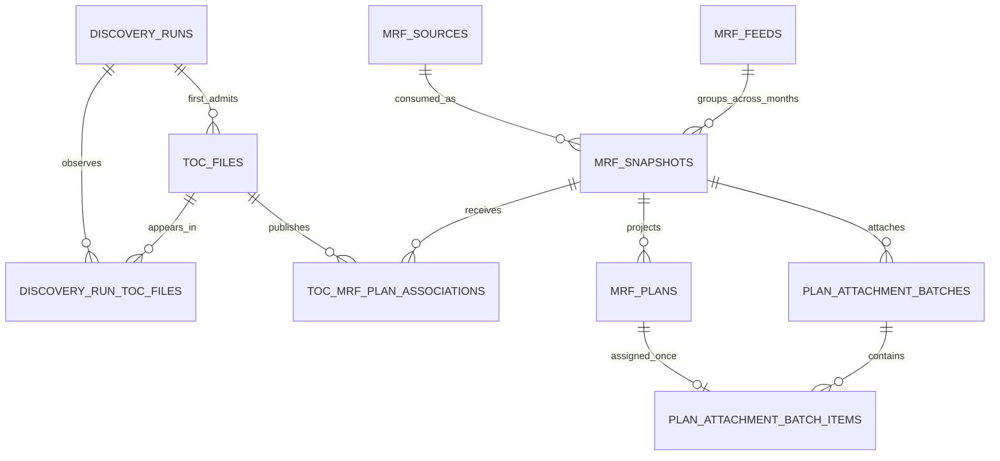

# Story 02: PostgreSQL domain schema and migrations

## Status

Planned.

## User story

As a pipeline operator, I want durable PostgreSQL records for discoveries,
TOCs, MRFs, consumer snapshots, and plan attachments so that background jobs
can retry safely and the pipeline can determine what work is genuinely new.

## Goal

Implement the PostgreSQL connection and application-migration layer, replace
the Story 01 `migrate` placeholder with a real idempotent command, and create
the normalized version 1 domain schema used by later River workers.

This story creates durable records and database constraints only. It does not
initialize River, enqueue or execute jobs, contact a payer, download files,
read Parquet, invoke sibling tools, or write local artifacts.

## Dependencies and scope

This story depends on Story 01.

Story 01 remains authoritative for:

- Module, executable, help, version, signal, and command-line syntax.
- Environment-variable names and lexical redaction rules.
- Command-specific configuration requirements.
- The rule that migrations are explicit rather than automatic.

This story replaces only the successful terminal behavior of
`mrfpipeline migrate`. `work` and `discover` remain side-effect-free
not-implemented operations after Story 01 validation.

## Product decisions

- PostgreSQL is the only version 1 application database.
- Version 1 requires PostgreSQL 15 or newer. The schema uses
  `UNIQUE NULLS NOT DISTINCT` for exact nullable plan tuples.
- Use `github.com/jackc/pgx/v5` directly. Do not use `database/sql`, an ORM, a
  query builder, or a repository framework.
- Application tables live in the fixed PostgreSQL schema `mrfpipeline` and
  are always referenced with that schema qualification.
- Database primary keys are PostgreSQL-generated `bigint` identity values.
  Do not use UUIDs, URL-derived identifiers, content hashes, file hashes, or
  hash-derived keys.
- Store discovered TOC and MRF URLs exactly as received. Exact URL equality,
  enforced by database uniqueness, is the version 1 deduplication rule.
- One `mrf_source` represents one exact downloadable URL and owns the
  expensive download/parse lifecycle.
- A separate `mrf_snapshot` connects that parsed source to a payer feed and
  collection month for consumer publication. URL identity does not claim to
  solve stable feed identity across months.
- Story 02 stores a caller/orchestrator-owned `feed_id` but does not infer or
  assign it. Story 08 defines the first UHC feed-assignment policy before it
  creates MRF snapshots.
- Domain state is separate from River job state. Application rows remain the
  durable source for pipeline progress and future UI status even if River job
  retention changes.
- Version 1 never deletes domain records automatically.

## Dependency baseline

Add the concrete PostgreSQL driver:

```text
github.com/jackc/pgx/v5 v5.9.2
```

Use `pgxpool` for the process database handle so later River integration can
reuse the same driver family. Story 02 may acquire one dedicated pool
connection while applying migrations.

Do not add River in this story. Story 03 selects and pins the River version,
adds River migrations, and extends the `migrate` command to apply both
migration sets.

## Database connection behavior

`mrfpipeline migrate` reads and lexically validates
`MRFPIPELINE_DATABASE_URL` exactly as Story 01 requires, then:

1. Parses it with `pgxpool.ParseConfig`.
2. Creates a bounded pool with at most two connections for the migration
   process.
3. Connects and pings PostgreSQL using the command context.
4. Verifies `server_version_num >= 150000`.
5. Acquires the fixed application migration advisory lock.
6. Applies every pending application migration in ascending version order.
7. Releases the lock, closes the pool, and reports success.

The application migration lock uses one fixed, documented pair of PostgreSQL
advisory-lock integers owned by this project. It is not derived from a URL,
database name, filesystem path, hash, process ID, or current time. Every
pipeline migrator uses the same pair so two migrators against one database
serialize.

Lock acquisition honors context cancellation. Waiting for another migrator is
allowed; there is no separate lock timeout flag in version 1. Pool creation,
ping, version detection, lock, migration, commit, unlock, and close errors are
classified as database failures without exposing the configured URL or server
diagnostic fields that may contain sensitive values.

Story 02 introduces the internal error classification:

```go
var ErrDatabase = errors.New("database operation failed")
```

Invalid environment configuration continues to match Story 01
`ErrInvalidConfig`. Driver parsing, connection, PostgreSQL-version, migration,
and schema-state failures wrap `ErrDatabase`. Context cancellation is returned
as the context error and does not match either classification.

## Migration mechanism

Application migrations are ordinary UTF-8 SQL files embedded in the binary:

```text
internal/database/migrations/
  0001_initial_domain.sql
```

Each filename is `<four-digit-version>_<lowercase-description>.sql`.
Versions begin at `0001`, are contiguous, and are applied in numeric order.
The description contains lowercase ASCII letters, digits, and underscores.

The migration ledger is:

```text
mrfpipeline.schema_migrations
```

| Column | PostgreSQL type | Contract |
|---|---|---|
| `version` | `integer` | Primary key and positive migration number. |
| `name` | `text` | Exact embedded migration filename. |
| `applied_at` | `timestamptz` | Required, defaults to `transaction_timestamp()`. |

Migration behavior:

1. Create the `mrfpipeline` schema and migration ledger when absent.
2. Validate every existing ledger row before applying work.
3. Reject duplicate, missing, noncontiguous, unknown-future, or filename-
   mismatched ledger entries as `ErrDatabase`.
4. Apply each pending migration in its own transaction.
5. Execute its SQL and insert its ledger row in the same transaction.
6. Roll back the complete migration transaction on any statement or ledger
   failure.
7. Never edit, rerun, or delete an applied migration.
8. Running `migrate` again at the current version succeeds with zero pending
   migrations and makes no schema change.

There are no down migrations, dirty flags, migration checksums, migration
repair flags, automatic destructive rebuilds, or schema adoption heuristics.
Changing an already released migration requires a new forward migration.

Story 02 owns application migration version `1`. River migration state is
separate and is not inserted into this ledger.

## Shared SQL conventions

All application tables follow these rules:

- Primary keys are `bigint GENERATED ALWAYS AS IDENTITY`.
- Timestamps are `timestamptz` and default to
  `transaction_timestamp()` where a creation time is required.
- Collection months use PostgreSQL `date`, always the first day of the month.
- External strings use `text`; do not impose arbitrary URL or plan-value
  length limits.
- Foreign keys use `ON DELETE RESTRICT` unless this story explicitly defines
  a pure join row with `ON DELETE CASCADE`.
- Status values use `text` plus named check constraints rather than
  PostgreSQL enum types.
- Every counter is `bigint` with a nonnegative check constraint.
- Application SQL names every inserted column and never depends on physical
  column order.
- Application timestamps are assigned by PostgreSQL, not by Go wall-clock
  time.
- Tables do not use update triggers. Later transactions update `updated_at`
  explicitly with `transaction_timestamp()` when changing mutable state.
- Collection months are stored as a first-of-month `date`. Go converts strictly
  between that date and sibling-tool `YYYY-MM` text at the tool boundary.
- `discovery_run_toc_files` and `plan_attachment_batch_items` are the only
  `ON DELETE CASCADE` joins. Every other foreign key remains `ON DELETE
  RESTRICT`.
- Every nonnull River job ID column requires a positive value.

The common stage-state vocabulary is:

```text
blocked
pending
running
succeeded
failed
```

`blocked` means that a required predecessor has not completed. `pending`
means the stage is eligible for scheduling or retry. `running` means a worker
has claimed the domain stage. `succeeded` is terminal for that stage.
`failed` is reserved for a terminally discarded or operator-declared failure;
ordinary retryable job errors return the stage to `pending` in later stories.

The common run-state vocabulary, used where there is no predecessor, is:

```text
pending
running
succeeded
failed
```

## Exact URL identity

TOC and MRF URL columns store the complete exact source string, including its
scheme, host, path, query, and fragment when present. PostgreSQL uniqueness is
applied directly to the `text` value.

The database layer does not:

- Trim, case-fold, parse, resolve, percent-decode, or otherwise normalize a
  URL.
- Remove query parameters or signed tokens.
- Compare filenames as a substitute for URL equality.
- Calculate a digest or content identity.
- Treat two different URLs as the same file.

Later download stories require HTTP or HTTPS and validate request safety
before use. Story 02 requires stored URLs to be nonempty valid PostgreSQL text
without carriage-return or newline characters. PostgreSQL itself rejects NUL
in `text`.

URLs are sensitive operational data. They may be selected by authorized
database users but must not appear in application errors or logs.

## Domain tables

Migration `0001_initial_domain.sql` creates the tables below.

### `discovery_runs`

One row represents one requested payer listing discovery.

| Column | Type | Contract |
|---|---|---|
| `id` | `bigint` identity | Primary key. |
| `payer_id` | `text` | Exact supported payer identifier. Version 1 permits only `uhc`. |
| `collection_month` | `date` | First day of the caller-selected month. |
| `toc_limit` | `integer` nullable | Positive admission limit. Version 1 CLI always writes a positive value; null is reserved for a future unlimited/chunked-admission story. |
| `status` | `text` | Run state; initially `pending`. |
| `discovered_count` | `bigint` | Listing URLs returned, including duplicate occurrences; initially `0`. |
| `existing_count` | `bigint` | Distinct first-occurrence URLs already known; initially `0`. |
| `admitted_count` | `bigint` | Newly inserted TOCs admitted by this run; initially `0`. |
| `overflow_count` | `bigint` | Distinct new first-occurrence URLs excluded by the admission limit; initially `0`. |
| `river_job_id` | `bigint` nullable | Reserved for Story 03; no foreign key. Must be positive when present. |
| `failure_code` | `text` nullable | Safe bounded classification, never raw error text. |
| `created_at` | `timestamptz` | Required creation time. |
| `started_at` | `timestamptz` nullable | First transition to `running`. |
| `completed_at` | `timestamptz` nullable | Terminal transition time. |
| `updated_at` | `timestamptz` | Required, initially creation time. |

Constraints require a valid first-of-month date, a positive limit when
present, nonnegative counts, `existing_count <= discovered_count`,
`admitted_count + overflow_count <= discovered_count - existing_count`, and
`existing_count + admitted_count + overflow_count <= discovered_count`. When
`toc_limit` is present, `admitted_count <= toc_limit`. A terminal status has
`completed_at`; a nonterminal status does not. A successful row has no failure
code. Story 05 finalizes counter updates and discovery transitions.

`payer_id` has an exact CHECK of `'uhc'` on every v1 table that stores it:
`discovery_runs`, `toc_files`, and `mrf_feeds`.

Every shared `failure_code` describes the currently failed stage and is null
otherwise. Explicit retry clears it; successful completion also leaves it
null. A failed download or parse leaves successor stages `blocked`, not
`failed`.

### `toc_files`

One row represents one exact payer TOC URL admitted to the pipeline.

| Column | Type | Contract |
|---|---|---|
| `id` | `bigint` identity | Primary key and source for formatted `toc-<id>` output identity. |
| `payer_id` | `text` | Exact payer identifier. |
| `collection_month` | `date` | Month assigned by the first admitting discovery. |
| `source_url` | `text` | Exact discovered URL. |
| `first_discovery_run_id` | `bigint` | References the admitting discovery run. |
| `download_status` | `text` | Initially `pending`. |
| `parse_status` | `text` | Initially `blocked`. |
| `import_status` | `text` | Initially `blocked`. |
| `download_river_job_id` | `bigint` nullable | Reserved for Story 03. |
| `parse_river_job_id` | `bigint` nullable | Reserved for Story 03. |
| `import_river_job_id` | `bigint` nullable | Reserved for Story 03. |
| `failure_code` | `text` nullable | Safe terminal failure classification. |
| `first_seen_at` | `timestamptz` | Required creation time. |
| `last_seen_at` | `timestamptz` | Updated when a later discovery returns the same exact URL. |
| `updated_at` | `timestamptz` | Required mutable-state timestamp. |

The exact unique key is `(payer_id, source_url)`. A later discovery of that
key reuses the row, preserves its original `collection_month` and first run,
and may only update `last_seen_at` plus discovery-observation data. The first
admitting run freezes `collection_month`. A wrong month is not corrected by
rediscovery or retry; rebuilding the affected pipeline and warehouse state is
required.

Stage constraints prevent parse from leaving `blocked` before download
succeeds and prevent import from leaving `blocked` before parse succeeds.
A failed download leaves parse and import `blocked`, not `failed`.
`toc_output_id` is not stored separately; later code formats it exactly as
`toc-<id>` from the database primary key.

Every nonnull `*_river_job_id` on this table and on `mrf_sources`,
`mrf_snapshots`, `discovery_runs`, and `plan_attachment_batches` must be
positive.

### `discovery_run_toc_files`

This join records every known or newly admitted TOC associated with a
discovery run after Story 05 applies its required limit.

| Column | Type | Contract |
|---|---|---|
| `discovery_run_id` | `bigint` | References `discovery_runs`. |
| `toc_file_id` | `bigint` | References `toc_files`. |
| `listing_ordinal` | `bigint` | Zero-based order returned by `mrfdiscoverer`. |
| `was_new` | `boolean` | True only when this run inserted the TOC row. |
| `created_at` | `timestamptz` | Required creation time. |

The primary key is `(discovery_run_id, toc_file_id)`. Each run also has a
unique `listing_ordinal`. Original first-occurrence ordinals are retained and
may contain gaps after in-listing duplicates. Distinct new URLs beyond the
admission limit increment `overflow_count` and are not inserted into
`toc_files` or this join. A later bounded discovery may admit them.

### `mrf_feeds`

One row represents one caller/orchestrator-owned logical feed series used by
`mrfconsumer` current-state selection.

| Column | Type | Contract |
|---|---|---|
| `id` | `bigint` identity | Primary key. |
| `payer_id` | `text` | Exact payer identifier. |
| `feed_id` | `text` | Exact consumer-compatible identifier. |
| `created_at` | `timestamptz` | Required creation time. |
| `updated_at` | `timestamptz` | Required mutable-state timestamp. |

The unique key is `(payer_id, feed_id)`. Both values match the lowercase ASCII
identifier contract `[a-z0-9][a-z0-9._-]{0,127}`. Do not encode Story 08's
`mrf-source-` assignment policy into the database constraint; a later curated
feed policy must remain possible. Story 02 does not infer feed identity from a
URL, filename, TOC plan, or database hash.

### `mrf_sources`

One row represents one exact downloadable MRF URL. This row owns downloading
and plan-independent `mrfparser` work.

| Column | Type | Contract |
|---|---|---|
| `id` | `bigint` identity | Primary key. |
| `source_url` | `text` | Exact globally unique MRF URL. |
| `first_mrf_filename` | `text` nullable | First nonempty TOC filename observed, for authorized audit only. |
| `download_status` | `text` | Initially `pending`. |
| `parse_status` | `text` | Initially `blocked`. |
| `download_river_job_id` | `bigint` nullable | Reserved for Story 03. |
| `parse_river_job_id` | `bigint` nullable | Reserved for Story 03. |
| `failure_code` | `text` nullable | Safe terminal failure classification. |
| `created_at` | `timestamptz` | Required creation time. |
| `updated_at` | `timestamptz` | Required mutable-state timestamp. |

`source_url` has one direct unique constraint. Repeating the exact URL from
any TOC reuses this row and never creates another download or parse lifecycle.
Different URLs remain different sources even when filenames or bytes might be
the same.

Parse cannot leave `blocked` before download succeeds. The local parser output
identity and artifact path are derived later from this numeric primary key;
they are not source identity and are not stored as hashes.

### `mrf_snapshots`

One row represents publication of one parsed MRF source for one payer feed and
collection month through `mrfconsumer`.

| Column | Type | Contract |
|---|---|---|
| `id` | `bigint` identity | Primary key and source for formatted consumer output identity. |
| `mrf_source_id` | `bigint` | References `mrf_sources`. |
| `mrf_feed_id` | `bigint` | References `mrf_feeds`. |
| `collection_month` | `date` | First day of the associated TOC month. |
| `consume_status` | `text` | Initially `blocked`. |
| `consume_river_job_id` | `bigint` nullable | Reserved for Story 03. |
| `failure_code` | `text` nullable | Safe terminal failure classification. |
| `created_at` | `timestamptz` | Required creation time. |
| `updated_at` | `timestamptz` | Required mutable-state timestamp. |

The unique key is `(mrf_source_id, mrf_feed_id, collection_month)`. The
referenced feed supplies `payer_id` and the exact consumer `feed_id`.
`mrfconsumer` output identity is formatted exactly as `mrf-<id>` from the
snapshot primary key and is therefore stable across retries without a hash or
separate mutable column.

Several sources may belong to one feed and collection month. This preserves
`mrfconsumer`'s explicit latest-month tie behavior rather than incorrectly
forcing one MRF file per logical feed.

### `toc_mrf_plan_associations`

This table preserves each imported TOC association needed for provenance and
retry-safe import.

| Column | Type | Contract |
|---|---|---|
| `id` | `bigint` identity | Primary key. |
| `toc_file_id` | `bigint` | References `toc_files`. |
| `mrf_snapshot_id` | `bigint` | References `mrf_snapshots`. |
| `mrf_location` | `text` | Exact TOC MRF location. |
| `mrf_filename` | `text` nullable | Exact optional TOC filename. |
| `plan_name` | `text` | Required nonempty source value. |
| `issuer_name` | `text` | Required nonempty source value. |
| `plan_sponsor_name` | `text` nullable | Validated source sponsor. |
| `plan_id_type` | `text` | Exact `ein` or `hios`. |
| `plan_id` | `text` | Required nonempty source value. |
| `plan_market_type` | `text` | Exact `group` or `individual`. |
| `created_at` | `timestamptz` | Required creation time. |

The exact unique key uses `UNIQUE NULLS NOT DISTINCT` across `toc_file_id`,
`mrf_snapshot_id`, `mrf_location`, `mrf_filename`, and all six source plan
fields. Importing the same completed TOC output again therefore inserts no
duplicate row, including when sponsor or filename is null.

Required plan strings are nonempty. EIN requires a nonempty sponsor. HIOS
allows a null or nonempty sponsor; an empty sponsor is invalid. Additional
TOC fields and JSON extension columns are not copied into the pipeline
database.

### `mrf_plans`

This table is the small sponsor-independent plan set that remains to be
attached to a consumer output.

| Column | Type | Contract |
|---|---|---|
| `id` | `bigint` identity | Primary key. |
| `mrf_snapshot_id` | `bigint` | References `mrf_snapshots`. |
| `plan_name` | `text` | Required nonempty value. |
| `issuer_name` | `text` | Required nonempty value. |
| `plan_sponsor_name` | `text` nullable | One valid operational sponsor used only to satisfy consumer JSON validation. |
| `plan_id_type` | `text` | Exact `ein` or `hios`. |
| `plan_id` | `text` | Required nonempty value. |
| `plan_market_type` | `text` | Exact `group` or `individual`. |
| `created_at` | `timestamptz` | Required creation time. |

The unique plan identity is `(mrf_snapshot_id, plan_name, issuer_name,
plan_id_type, plan_id, plan_market_type)`. Sponsor is deliberately excluded.

For EIN, the first imported nonempty sponsor for a newly inserted five-field
identity is retained and is not replaced by a later sponsor variant. For HIOS,
the projected row stores null sponsor even when a TOC supplied one. The
provenance table above preserves every accepted source sponsor. These rules
produce one stable valid JSON row for Story 12 while matching
`mrfconsumer`'s sponsor-independent identity.

### `plan_attachment_batches`

One row represents one future additive `mrfconsumer.AttachPlans` operation.

| Column | Type | Contract |
|---|---|---|
| `id` | `bigint` identity | Primary key and source for formatted plan batch identity. |
| `mrf_snapshot_id` | `bigint` | References `mrf_snapshots`. |
| `status` | `text` | Run state; initially `pending`. |
| `river_job_id` | `bigint` nullable | Reserved for Story 03; no foreign key. |
| `requested_plan_count` | `bigint` | Number of batch items; initially `0`. |
| `added_plan_count` | `bigint` nullable | Consumer-reported additions after success. |
| `failure_code` | `text` nullable | Safe terminal failure classification. |
| `created_at` | `timestamptz` | Required creation time. |
| `started_at` | `timestamptz` nullable | First transition to `running`. |
| `completed_at` | `timestamptz` nullable | Terminal transition time. |
| `updated_at` | `timestamptz` | Required mutable-state timestamp. |

The consumer `PlanBatchID` is formatted exactly as `plan-batch-<id>` from this
primary key. It is stable across River retries and is not plan identity.
A successful batch may report zero additions because the consumer is the
final idempotency authority for its warehouse.

### `plan_attachment_batch_items`

This join freezes the exact plans assigned to one attachment batch.

| Column | Type | Contract |
|---|---|---|
| `plan_attachment_batch_id` | `bigint` | References `plan_attachment_batches`; delete cascades only for an uncommitted test fixture or future explicitly authorized batch deletion. |
| `mrf_plan_id` | `bigint` | References `mrf_plans`. |
| `created_at` | `timestamptz` | Required creation time. |

The primary key is `(plan_attachment_batch_id, mrf_plan_id)`. A separate
unique constraint on `mrf_plan_id` prevents one plan from being assigned to
several batches. Later reconciliation derives plan state as:

- No batch item: pending attachment.
- Item in a pending or running batch: batched.
- Item in a succeeded batch: attached.
- Item in a failed batch: retained for explicit retry or recovery of that same
  batch; it is not silently assigned a new batch ID.

## Identity and relationship diagram



The diagram deliberately separates exact transport identity (`mrf_sources`)
from analytical feed/month identity (`mrf_snapshots`). Multiple TOCs may point
to one MRF source and contribute plans to one snapshot without creating
another download or parser lifecycle.

## Operational indexes

Include these indexes in migration `0001` before implementation lands. Do not
wait for Story 13 to discover them. They do not change uniqueness or identity
semantics.

| Index | Purpose |
|---|---|
| `discovery_runs(status)` | Startup/reconcile nonterminal run scans. |
| `toc_files(download_status)` | Download-stage scans. |
| `toc_files(parse_status)` | Parse-stage scans. |
| `toc_files(import_status)` | Import-stage scans. |
| `mrf_sources(download_status)` | Shared download-stage scans. |
| `mrf_sources(parse_status)` | Shared parse-stage scans. |
| `mrf_snapshots(mrf_source_id)` | Parse-success snapshot scheduling. |
| `mrf_snapshots(consume_status)` | Consumer-stage scans. |
| `plan_attachment_batches(mrf_snapshot_id)` | Unresolved-batch lookup under a snapshot lock. |
| `plan_attachment_batches(status)` | Attachment-stage scans. |
| `mrf_plans(mrf_snapshot_id)` | Unassigned-plan selection. |

`plan_attachment_batch_items(mrf_plan_id)` is already unique and is the join
used to detect unassigned plans. Do not add hash-derived or URL-derived
indexes.

## Transaction and concurrency rules

Story 02 provides concrete query helpers only where needed by migration and
schema integration tests. Later stories own operational upserts and stage
transitions, but all of them must preserve these database rules:

- Unique constraints, not a preceding select, arbitrate URL, association,
  snapshot, plan, and batch-item uniqueness.
- Creation of a parent row and its initial related rows occurs in one
  transaction.
- A worker stage transition uses a row lock or one conditional update that
  proves the expected prior state.
- A stage success update and insertion of its successor River job occur in one
  database transaction once River is introduced.
- Retrying a transaction after serialization, deadlock, or connection failure
  must repeat the complete transaction rather than infer partial success.
- Do not hold a database transaction open while performing HTTP, filesystem,
  parser, consumer, or other long-running external work.
- Same-warehouse consumer serialization is implemented through River queue
  topology in later stories, not through an advisory lock added here.

Story 02 does not add `SELECT ... FOR UPDATE SKIP LOCKED`, polling, LISTEN /
NOTIFY, triggers, stored procedures, or a custom job table.

## Migration command result and exit behavior

On success, `mrfpipeline migrate` writes one compact JSON object followed by
one newline:

```json
{"application_version":1,"applied_migration_count":1}
```

`application_version` is the greatest applied application migration version.
`applied_migration_count` is the number applied by this invocation and is `0`
on a repeated current migration.

No human-readable success line is written to standard error. The result does
not include the database URL, host, port, database name, server version,
migration SQL, duration, or advisory-lock key.

Exit behavior extends Story 01:

| Outcome | Exit status | Usage hint |
|---|---:|:---:|
| Migration success | `0` | No |
| Invalid configuration | `2` | Yes |
| Database or migration failure | `3` | No |
| Cancellation or result-write failure | `1` | No |

If JSON reporting fails after committed migrations, the command exits `1` but
does not roll back or rerun committed work. A write failure may leave a partial
standard-output prefix. Diagnostics remain redacted.

## Security and redaction

- The database URL is never included in errors, logs, reports, or migration
  ledger rows.
- Wrap driver failures with a safe operation name and `ErrDatabase`; do not
  forward raw SQL, connection strings, query arguments, server notices, or
  PostgreSQL detail/hint fields to the CLI.
- Migration filenames and numeric versions are safe to report in focused
  internal tests but are omitted from ordinary CLI failure diagnostics.
- URLs and plan values are stored because they are required domain data, but
  are never copied into `failure_code` or application diagnostics.
- `failure_code` values are from a future fixed application vocabulary and
  never contain arbitrary `error.Error()` text. Story 02 leaves them null.
- Story 02 does not create a database role, grant broad privileges, manage
  credentials, enable TLS, or modify PostgreSQL server configuration. Those
  are deployment responsibilities.

## Required tests

### Unit tests

- Database URL driver-parse failures wrap `ErrDatabase` without exposing the
  URL.
- Context cancellation remains distinguishable from invalid configuration and
  database failure.
- Embedded migration filenames are valid, contiguous, unique, and ordered.
- The migration result JSON is compact and contains only the two defined
  fields.
- CLI exit classifications and post-commit reporting behavior match this
  story.

### PostgreSQL integration tests

Integration tests run only when `MRFPIPELINE_TEST_DATABASE_URL` is set. The
URL must name a disposable database whose database name begins with
`mrfpipeline_test_`; otherwise the test fails before executing DDL. Dedicated
CI must provide and run this database suite. Ordinary local tests skip it when
the variable is absent.

The suite proves:

- PostgreSQL versions before 15 are rejected without creating application
  tables.
- A fresh migration creates the exact schema, ledger, tables, columns,
  defaults, primary keys, foreign keys, unique indexes, and check constraints.
- A second migration succeeds with zero applied migrations and leaves the
  schema unchanged.
- Two concurrent migrators serialize and produce one applied ledger row.
- A failing injected migration rolls back its DDL and ledger insert.
- Unknown, missing, noncontiguous, and filename-mismatched ledger state is
  rejected without repair.
- Every invalid status, month, counter, identifier, URL newline, plan enum,
  sponsor condition, overflow/admitted arithmetic, zero/negative River job ID,
  and lifecycle combination is rejected by the relevant database constraint.
- Exact duplicate TOC URLs, MRF URLs, discovery membership, feed IDs,
  snapshots, TOC associations including null values, sponsor-independent MRF
  plans, and batch items are rejected by database uniqueness.
- `payer_id` values other than `uhc` are rejected on `discovery_runs`,
  `toc_files`, and `mrf_feeds`.
- `feed_id` accepts any consumer-compatible identifier and does not require an
  `mrf-source-` prefix.
- Different URL strings remain distinct even when they share a filename or
  differ only by case, query, escaping, or fragment.
- The same MRF source can participate in several valid snapshots while its URL
  remains stored once.
- Multiple TOCs can point to one snapshot and contribute overlapping plans
  while `mrf_plans` retains only the five-field unique set.
- EIN projection requires a sponsor, HIOS projection stores null sponsor, and
  sponsor variants do not create another `mrf_plans` identity.
- Foreign-key restrictions prevent deleting referenced domain parents.
- Migration and integration-test failures do not expose the test database URL
  in production error strings.

Run:

```text
go test ./...
go test -race ./...
go vet ./...
```

## Acceptance criteria

- `mrfpipeline migrate` initializes and advances the exact application schema
  in PostgreSQL 15 or newer.
- Repeated and concurrent migration invocations are safe and idempotent.
- The application schema distinguishes an exact downloadable MRF source from
  a payer/feed/month consumer snapshot.
- `discovery_runs` stores `overflow_count` for distinct new URLs excluded by
  the required admission limit.
- Operational stage, snapshot-by-source, batch, and unassigned-plan indexes
  exist in `0001`.
- Exact database constraints prevent duplicate URLs, TOC associations,
  sponsor-independent snapshot plans, and batch assignment.
- Multiple TOCs may associate plans with one MRF without creating another MRF
  download or parse record.
- Numeric database identities provide stable formatted tool/job identifiers
  without hashes.
- Domain stage state is durable and ready for River integration, but no River
  table, job, client, or worker exists yet.
- `work` and `discover` retain their Story 01 placeholder behavior.
- Database and migration failures are classifiable and redacted.

## Non-goals

- River schema migrations or application workers.
- Discovery-run enqueueing or payer listing access.
- Automatic feed inference or cross-month feed matching.
- HTTP download behavior.
- Artifact paths, manifests, cleanup, or retention.
- Reading TOC Parquet or creating MRF records from TOC contents.
- Invoking `mrftocparser`, `mrfparser`, `mrfconsumer`, or `mrfenricher`.
- Automatically running provider enrichment.
- Creating or updating a consumer warehouse.
- Plan JSON creation or plan attachment.
- Job retries, reconciliation, operator repair, or a UI.
- Down migrations, migration rewriting, migration hashes, or automatic schema
  repair.
