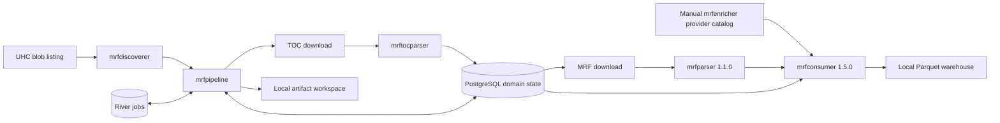
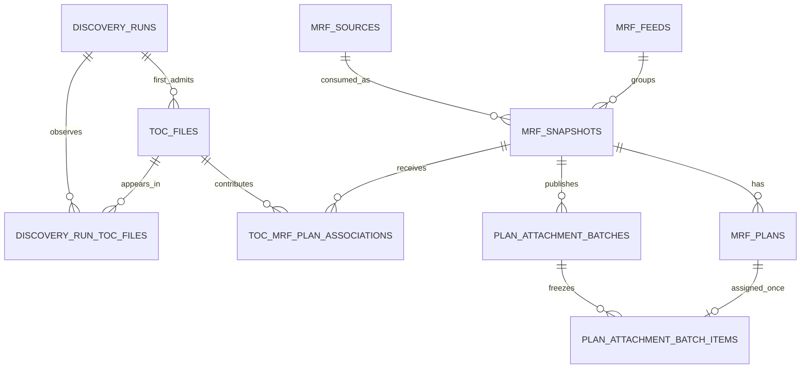
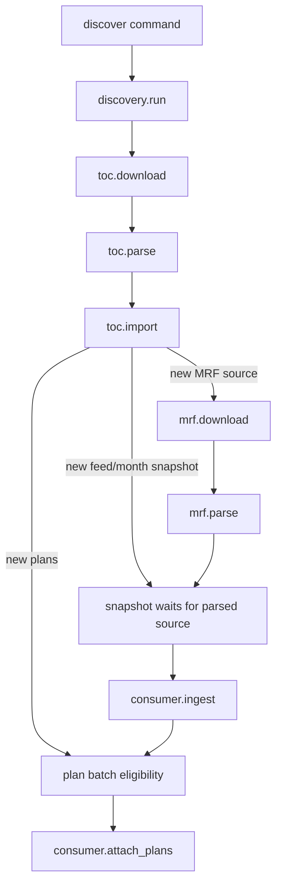

# mrfpipeline design

## Document status

This document describes the implemented Stories 01–27 architecture. The
numbered requirement stories remain authoritative where they are more
specific. Sections below the approved contract that are explicitly labeled
historical version 1 are retained as background only; they are not current
runtime guidance. The Stories 14–27 requirements and current README describe
the rebuild-only feed-free contract and runnable local operation.

The design records the implemented version 1 decisions that remain normative
except where the target addendum explicitly replaces them:

- Discover TOCs incrementally; do not wait for an unknowable "complete" payer
  set before processing useful work.
- Require a positive admission `--limit` on every discovery. Omitted or
  unlimited discovery is deferred until chunked admission has its own design.
- Download and parse one exact MRF URL once, even when several TOCs reference
  it.
- Keep `mrfparser` plan-independent and serialize every `Parse` call with a
  process-level mutex.
- Ingest rates once per consumer snapshot, then attach newly discovered plans
  additively without rewriting rate/provider data.
- Treat TOC captures as payer + collection month + exact URL, and MRF source
  captures as exact URL + collection month. A wrong month is rebuilt, not
  corrected in place.
- Use PostgreSQL domain records as durable pipeline truth and River for
  at-least-once background execution.
- Use numeric database identities and exact database uniqueness. Do not add
  hashes as URL, artifact, job, plan, or output identity.

## Active current architecture: Stories 14–27

The current contract is defined by:

- [Story 14: Feed-free domain schema](14-feed-free-domain-schema.md)
- [Story 15: Month-specific TOC captures](15-month-specific-toc-captures.md)
- [Story 16: Feed-free TOC import and snapshot scheduling](16-feed-free-toc-import-and-snapshot-scheduling.md)
- [Story 17: Consumer 2.0 feed-free integration](17-consumer-2-feed-free-integration.md)
- [Story 18: Monthly release activation](18-monthly-release-activation.md)
- [Story 19: Release-aware reconciliation, acceptance, and documentation](19-release-aware-reconciliation-acceptance-and-documentation.md)
- [Story 20: Production hardening and test readiness](20-production-hardening-and-test-readiness.md)
- [Story 21: Bounded local worker scaling](21-bounded-local-worker-scaling.md)
- [Story 22: Runnable local acceptance and test convergence](22-runnable-local-acceptance-and-test-convergence.md)
- [Story 23: Terminal MRF parse slot release](23-terminal-parse-slot-release.md)
- [Story 24: Nullable plan sponsor on TOC import](24-nullable-plan-sponsor-import.md)
- [Story 25: River UI cancel of MRF occupancy](25-river-ui-cancel-slot-release.md)
- [Story 26: Delete leftover download bytes on cancel and exhaustion](26-terminal-download-artifact-delete.md)
- [Story 27: Incremental release publication](27-incremental-release-publication.md)

Stories 14–17 were one atomic breaking delivery batch. Consumer `2.0.0` is
available, and there is no adapter,
compatibility mode, feature flag, dual consumer version, temporary feed state,
or supported intermediate runtime.

Stories 14–19 intentionally replace these version 1 decisions:

1. `mrf_feeds` and `feed_id` are removed. Snapshot identity is exact MRF
   source + payer + collection month.
2. TOC identity is payer + collection month + exact URL. A stable TOC URL is
   downloaded and processed independently in each admitted month.
3. MRF source capture identity is exact URL + collection month. A stable MRF
   URL is downloaded and parsed independently in each admitted month, without
   hashes, ETags, byte comparison, or URL normalization.
4. The pipeline integrates exact feed-free `mrfconsumer 2.0.0`; old database
   and warehouse state is rebuild-only.
5. Serving uses a manually activated monthly release per payer, not consumer
   `current_*` views or greatest-month inference.

The target source/snapshot model is:

```text
mrf_source   = one exact MRF URL + collection month capture and lifecycle
mrf_snapshot = one mrf_source + payer + collection month
output_id    = mrf-<mrf_snapshot.id>
```

The target release model is:

```text
building -> active -> inactive
             ^           |
             +-----------+  exact rollback/reactivation
```

A building month receives bounded discovery and background processing. First
activation requires discovery/TOC processing to be terminal, freezes that
source/plan inventory, persists only the currently consumed, plan-ready,
warehouse-validated output IDs, and atomically switches the payer's active
month. Numeric source targets and terminal TOC/MRF file failures are allowed.

Active releases remain executable for already-known MRF download, parse,
consumer ingest, and plan attachment. Pending MRF work is not published and
does not block the checkpoint. Repeating activation appends newly plan-ready
outputs to durable `monthly_release_outputs`; existing membership is never
removed. Inactive releases are fully frozen. Warehouse files are never
rewritten by activation or rollback.

Active state is a relation rather than one global month. The compact release
view is:

```text
uhc   -> 2026-09
aetna -> 2026-08
```

A future query service joins each active release to its persisted published
output membership, derives `output_id` as `mrf-<snapshot-id>`, validates the
complete relation against the warehouse, and atomically publishes verified
serving state without rescanning warehouse metadata. It never exposes every
snapshot merely because the month is active. A payer-filtered query uses that
payer's output rows; a query without a payer filter uses every active output
row.
Payers with no active release contribute no served data. Consumer outputs with
no pipeline snapshot are not release members even when payer/month matches.
Query planning, partition pruning, and performance acceptance remain consumer
or future query-service responsibilities.

The target keeps these version 1 invariants:

- exact URL strings and numeric database identities, without hashes;
- one MRF source parse per exact URL/month reused by overlapping same-month
  TOCs and payer snapshots;
- one independent consumer output per source/payer/month;
- plan-independent parse/ingest and additive output-scoped plan attachment;
- PostgreSQL domain truth plus River at-least-once execution;
- one control lease, role-specific River workers, and serialized consumer writers until the pinned consumer contract permits more;
- immutable parser/consumer publication boundaries; and
- explicit retry, conservative reconciliation, redaction, and local-only
  storage.

The target remains UHC-only for production discovery. Generic payer columns
and per-payer release state prepare the domain/query boundary for later payer
adapters without claiming they exist now.

## Current Story 21 worker addendum

Story 21 supersedes the single-process deployment guidance below for current
operation. The control role is the only singleton and holds the database
control lease. MRF roles own only download and parse queues; each process runs
at most one parser, and multiple ordinary River processes may be started.
Consumer roles own ingest and plan-attachment queues and remain one process
until the pinned consumer writer contract permits distinct-output concurrency.
All roles share the initialized artifact root, while one durable PostgreSQL
resident-capacity limit bounds raw and in-progress MRF materializations. A
terminal parse is no longer in progress after its raw and parser staging are
cleaned, so its selected failed source releases the resident slot.
The local Compose defaults are `./local/provider-catalog` and
`./local/services.csv`; MRF and consumer services are behind the `workers`
profile so prerequisites and control can be started before processing. The
redacted stalled-work query is run against private Compose PostgreSQL with
`docker compose ... exec -T postgres psql ... < scripts/stalled-work.sql`.

```text
mrfpipeline work --role control
mrfpipeline work --role mrf
mrfpipeline work --role consumer
```

The older one-worker and serialized-topology statements below are historical
version-1 context; they do not override this addendum.

## Current Stories 22–26 local operation

The current deployment is one control process, one or more ordinary MRF River
processes, and exactly one consumer process. Queue ownership is explicit:

| Role | Queues | Cardinality |
|---|---|---|
| control | discovery, TOC download/parse/import, admission and control scheduling | one control lease |
| mrf | MRF download and parse | one parser call per process; scale processes |
| consumer | consumer ingest and plan attachment | one process with the pinned writer |

Discovery imports feed-free monthly captures. Source admission selects a
cumulative stable prefix and the shared resident-slot table admits only as
many raw/in-progress sources as capacity permits. A slot is held across MRF
download and in-flight parse, and is released after successful parse cleanup
or terminal-parse cleanup (and after terminal empty-download cleanup as today).
River UI cancel of `mrf.download` or `mrf.parse` is that same terminal occupancy:
the stage fails, files are removed, and the slot is released. Story 26 extends
this to `toc.download`: a terminal download failure, including retry exhaustion,
HTTP 404, or River UI cancel, deletes unpublished download bytes and matching
staging. MRF download cleanup then releases the slot. Worker recreate/SIGTERM
stays an interruption and keeps bytes for resume. The capacity is a source
count, not a byte quota.

Terminal TOC/MRF file failure is excluded from publication and no longer blocks
an incremental activation checkpoint. Cleanup still removes unpublished output,
parser staging, and raw bytes, releases the slot, and wakes control; it never
substitutes another selected URL. Automatic parse retries retain raw bytes and
the slot. `retry --stage mrf.parse` reuses valid raw bytes or rematerializes
through admission when bytes are gone. `mrf.parse`, `mrf.download`, and
`toc.download` jobs have four total attempts; every other production kind has
eight.

Every MRF source and consumer output has an exact execution lock. Locks are
deterministic PostgreSQL advisory keys over positive `bigint` identities; they
are not hashes and are never part of ordinary logs. A busy lock defers work,
while a lost lock interrupts it before success confirmation.

The active-output handoff is the persisted
`(payer, collection_month, output_id)` membership, not every snapshot in the
month. Activation does not serve queries and this repository has no query API
or SQL facade. Numeric targets are valid checkpoints; `partial:true` and
`mrf_source_target_partial` remain explicit full-month coverage diagnostics.

The local Compose recipe builds with BuildKit SSH forwarding, mounts the
operator's accepted catalog and selector, starts PostgreSQL and migration,
then starts control before MRF and consumer roles. Control has no automatic
restart for permanent configuration/capacity errors. No stale-file health
check or heartbeat table is used. Parsed MRF output, warehouse output,
PostgreSQL data, and River history have no automatic retention policy.

## Historical version 1 implementation reference

Everything below this heading is retained for migration and incident context
only. It is not the active deployment or schema contract. Where it mentions
feeds, sticky months, consumer `1.5.0`, `current_*` views, or a single worker,
Stories 14–24 and the README supersede it.

The following architecture sections preserve the original Stories 01–13
design for migration and incident context. Where they mention feeds, sticky
months, consumer `1.5.0`, or `current_*` views, the active contract above and
the numbered requirements supersede them.

### Historical Purpose (Stories 01–13)

CMS Transparency in Coverage data is published as a large graph rather than a
single file:

1. A payer-specific listing exposes table-of-contents files.
2. Each TOC associates plans with one or more in-network MRF locations.
3. The same in-network MRF can appear in several TOCs and can acquire more plan
   associations later.
4. In-network MRFs are large and expensive to download and parse.
5. Parsed rate data must be filtered through a manually maintained provider
   catalog and combined into one analytical warehouse.

The independent tools already own each transformation. `mrfpipeline` owns the
durable coordination between them:

- what was discovered;
- which exact source is new;
- what stage is eligible;
- which work is already complete;
- how a crash is retried;
- which payer/feed/month snapshot consumes a parsed source; and
- which plans have been attached to that snapshot.

The pipeline is not a replacement parser or warehouse engine. It passes stable
inputs into the existing tools, validates their publication boundaries, and
records durable orchestration state.

## Goals

Version 1 must:

- Run a manually triggered UHC TOC discovery with a required positive
  `--limit`.
- Support a small first live progression: one newly admitted TOC, then two,
  then five, with ten only after measuring fan-out and disk use.
- Store discoveries, TOCs, exact MRF URLs, feed/month snapshots, plan
  associations, and stage state in PostgreSQL.
- Execute download, parse, import, consumer-ingest, and plan-attachment work in
  River background jobs.
- Retry safely after a process, database, network, or tool failure.
- Reuse a completed MRF parse when another TOC references the same exact URL.
- Create one consumer snapshot for each required payer/feed/month association.
- Add newly discovered plans to an existing consumer output without
  re-ingesting rates.
- Keep large downloads and parser outputs in a deterministic local workspace.
- Preserve a single local `mrfconsumer` warehouse with serialized writers.
- Use a provider catalog produced manually by `mrfenricher`.
- Expose enough durable state for a later operational UI without building that
  UI now.

## Non-goals

Version 1 does not include:

- Automatic `mrfenricher` execution or taxonomy refresh scheduling.
- A web API, dashboard, or end-user plan-search UI.
- A payer other than UHC.
- Internal recurring discovery scheduling.
- Omitted or unlimited discovery admission; that waits for a chunked-admission
  story.
- HTTP proxy environment variables, custom TLS, or private-network downloads.
- Range-resume downloads or remote content revalidation under an exact URL.
- Removal or replacement of an attached plan.
- Correction of a bad plan association inside an existing warehouse.
- MRF content deduplication across different URLs.
- URL normalization or filename-based identity.
- Content hashes, file hashes, hash-derived paths, or hash-derived job keys.
- S3 pipeline artifacts, distributed storage, or several worker hosts.
- Several concurrent worker processes writing one warehouse.
- Migration of old parser outputs or pre-1.5.0 consumer warehouses.
- Automatic source/artifact retention or deletion beyond stage-owned cleanup.

## System context



PostgreSQL and River are the control plane. The local artifact workspace,
parser outputs, provider catalog, and consumer warehouse are the data plane.

## Existing component contracts

The pipeline integrates with these independently usable tools. Their own
requirements remain authoritative for parsing and warehouse semantics.

| Component | Pipeline use | Version 1 boundary |
|---|---|---|
| `mrfdiscoverer` | Return current UHC TOC URLs in listing order. | UHC listing only; it does not download TOCs. |
| `mrftocparser` | Parse one local TOC into `toc_files` and flattened `mrf_plan_associations`. | Local input/output, exact schema `1.0.0`, final `manifest.json`. |
| `mrfparser` | Parse one local in-network MRF using the configured service selector. | Exact plan-independent schema `1.1.0`, eight datasets, final `manifest.json`. |
| `mrfenricher` | Produce an up-to-date provider catalog for selected taxonomies. | Operator runs it manually; pipeline receives a local catalog path. |
| `mrfconsumer` | Ingest one parser output into a snapshot and attach plans later. | Exact warehouse/snapshot version `1.5.0`; serialized local writers. |

The active pipeline pairing is exact: parser `1.1.0` with consumer `1.5.0`.
Parser `1.0.0` outputs and consumer `1.4.0` warehouses belong to the former
plan-aware layout and are not mixed with or migrated into this pipeline.

The pipeline must not copy the implementation of a sibling tool. It validates
the documented inputs, versions, reports, and final manifests needed to decide
whether a stage completed.

The parser workers call the public Go packages directly. They preserve context
cancellation, exact version checks, output redaction, and single-invocation
semantics. Module path casing must match each actual `go.mod`: this repository
is `github.com/enotpoloskun/mrfpipeline`; sibling imports keep their published
paths (`EnotPoloskun` or `enotpoloskun`) rather than being rewritten.

`mrfparser` temporarily changes the process-wide Go memory limit.
Its River queue has maximum concurrency one, and every call to
`mrfparser.Parse` is additionally guarded by one process-level mutex. Queue
concurrency is not the parser safety contract: River 0.39 rescue can mark an
overdue running job retryable without terminating the existing Go invocation.
Story 10 logs stored-byte parse progress through a public parser callback; if
the pinned parser release has no callback, add it in `mrfparser` and pin that
release before implementing the worker.

`mrftocparser` has no temp-directory field. The worker process sets `TMPDIR`
once, before starting River, to `<artifact-root>/.staging`, and never mutates
it around individual calls. Two concurrent TOC parses are allowed. TOC parsing
may overlap an MRF parse in version 1; measure RSS before adding coordination.
TOC parser manifests remain capped at 1 MiB; MRF parser manifests remain
capped at 4 MiB with a separate 64 KiB `processing_stats.json` limit. Those
limits stay different.

## Deployment model

Version 1 assumes one deployment unit with:

- PostgreSQL 15 or newer.
- One `mrfpipeline work` process for one application database and one
  warehouse.
- One local artifact filesystem visible to that worker.
- One local `mrfconsumer` warehouse.
- One local provider catalog prepared by the operator.
- One local service-selector CSV passed to `mrfparser`.
- Outbound public HTTP/HTTPS access to payer and CDN endpoints.

The database may be remote. The artifact workspace, provider catalog, service
selector, and warehouse must be accessible through local filesystem paths on
the worker host. Version 1 does not coordinate a shared filesystem between
hosts.

The one-process rule is important. River queue concurrency is per client, not
cluster-wide. Starting a second worker process would multiply download/parser
concurrency and could permit two writers to mutate the same consumer warehouse.

The supported topology is enforced with the literal PostgreSQL session
advisory lease `pg_try_advisory_lock(7319, 1)`, held on one dedicated
connection for the complete `work`, `reconcile`, or `retry` command. Lease
loss cancels worker operation and prevents beginning another consumer write.

## Operator commands

The version 1 executable has five operational commands:

```text
mrfpipeline migrate
mrfpipeline work
mrfpipeline discover --payer uhc --collection-month <YYYY-MM> --limit <count>
mrfpipeline reconcile
mrfpipeline retry --stage <job-kind> --id <domain-id>
```

`migrate` explicitly applies current application and River migrations. No
other command migrates automatically.

`work` validates the complete worker configuration and current schema, opens
the local workspace, acquires the exclusive worker lease, runs the same safe
reconciliation as `reconcile`, starts the registered River workers, and runs
until canceled.

`discover` creates and enqueues one durable discovery run. `--limit` is
required and must be a positive `int64`. The command does not wait for TOC
downloads, MRF parsing, consumer ingestion, or plan attachment. The
`discovery_runs.toc_limit` column remains nullable only so a later
chunked-admission story can store unlimited runs; version 1 never writes null.

`reconcile` acquires the exclusive worker lease and repairs safely inferable
nonterminal scheduling/artifact gaps. `retry` grants one fresh River attempt
series to one explicitly selected failed stage while preserving its database
identity and immutable batch/output identities. Neither command runs work
synchronously. `retry` requires the worker to be stopped.

Optional River UI is not a pipeline command. Operators may run River's
open-source UI as a separate process against `MRFPIPELINE_DATABASE_URL` with
schema `mrfpipeline_river` to inspect queues and pause them. Pause stops
fetching new jobs; it does not cancel in-flight work. Cancelling
`mrf.download`, `mrf.parse`, or `toc.download` from that UI fails the stage and
deletes unpublished download bytes; download retry exhaustion does the same.
Recreate/SIGTERM stays an interruption. Do not retry or delete jobs from the UI;
do not cancel other kinds.

Discovery is manually invoked or scheduled externally. The caller supplies
the collection month as an operator-owned label for that listing; the pipeline
does not infer it from current time, a URL, or payer contents, and does not
check it against blob dates. The first admitting run freezes that month on the
TOC row. A wrong first admission is not corrected by rediscovery or retry; it
requires rebuilding the affected pipeline and warehouse state.

`reconcile` needs the complete worker environment. `retry` needs only the
database URL. Both fail without mutation while the leased worker is active.

## Runtime configuration

The established environment is:

| Variable | Purpose |
|---|---|
| `MRFPIPELINE_DATABASE_URL` | PostgreSQL application and River database. |
| `MRFPIPELINE_ARTIFACT_ROOT` | Pipeline-owned local downloads and intermediate outputs. |
| `MRFPIPELINE_WAREHOUSE_PATH` | One local `mrfconsumer` warehouse root. |
| `MRFPIPELINE_PROVIDER_CATALOG_PATH` | Manually prepared provider catalog. |
| `MRFPIPELINE_SERVICES_PATH` | Service-selector CSV for `mrfparser`. |

`migrate`, `discover`, and `retry` need only the database URL. `work` and
`reconcile` need the complete set. Configuration has no file format and
secrets are not accepted through command-line flags.

## Durable identity model

### Numeric identities

PostgreSQL-generated positive `bigint` identity values own application
records. They produce stable operational identifiers such as:

```text
toc-42
mrf-source-81
mrf-105
plan-batch-230
```

These are formatted database identities. They are not source identity or
content identity.

### URL identity

TOC and MRF source identity is exact stored URL equality:

- TOCs are unique by `(payer_id, source_url)`.
- MRF sources are globally unique by `source_url`.

The pipeline does not trim, case-fold, percent-decode, reorder queries, remove
tokens, compare basenames, follow redirects to derive identity, or compare
downloaded bytes. Two different URL strings remain different records even if
they happen to return the same bytes.

### MRF source versus consumer snapshot

An MRF source and a consumer snapshot are deliberately separate:

```text
mrf_source = one exact URL + one download/parse lifecycle
mrf_snapshot = one parsed source + one payer feed + one collection month
```

One source can therefore be parsed once and consumed into several feed/month
snapshots when TOC associations require it. One snapshot has one stable
consumer `output_id`, formatted as `mrf-<mrf_snapshots.id>`.

This avoids re-parsing shared MRFs without pretending that an exact URL is a
stable logical feed identifier across months.

Version 1 assigns `feed_id=mrf-source-<mrf_sources.id>`. That value means
"this exact source URL," not "this logical UHC network across monthly URL
rotations." Consumer `current_*` views are therefore unsafe as cross-month
network current-state until a curated feed map exists. Serving must filter an
explicit `collection_month` or treat the warehouse as single-month. Adding a
curated cross-URL map later requires rebuilding the warehouse.

### Plan identity

Plans are unique within an MRF snapshot by the exact five-field tuple:

```text
plan_name
issuer_name
plan_id_type
plan_id
plan_market_type
```

Sponsor is validated and retained for TOC provenance where supplied, but is
not consumer plan identity. EIN canonical rows may retain a null sponsor when
all accepted provenance sponsors are null; a later nonempty sponsor fills that
null and never replaces an existing nonempty value. HIOS stores a null
operational sponsor in the projected canonical row; an empty sponsor is
invalid.

Plan attachment batch IDs name additive publication attempts. They are not
plan identity and are not reused for a different set of newly batched plans.

## Domain model

Application tables live in PostgreSQL schema `mrfpipeline`. River manages its
own tables in `mrfpipeline_river`.

The central application records are:

| Table | Meaning |
|---|---|
| `discovery_runs` | One caller-requested payer listing discovery, including admitted and overflow counts. |
| `toc_files` | One exact admitted payer TOC URL and its download/parse/import stages. |
| `discovery_run_toc_files` | Which admitted TOCs appeared in one run and in what listing order. |
| `mrf_feeds` | Caller/orchestrator-owned payer feed identities. |
| `mrf_sources` | One exact MRF URL and its shared download/parse lifecycle. |
| `mrf_snapshots` | One source consumed for one feed and collection month. |
| `toc_mrf_plan_associations` | Full accepted TOC provenance connecting a TOC, snapshot, MRF location, and plan. |
| `mrf_plans` | Sponsor-independent plan set still to be attached to each snapshot. |
| `plan_attachment_batches` | One additive consumer attachment attempt. |
| `plan_attachment_batch_items` | Frozen plans assigned to that batch. |



Domain records are retained even after River prunes completed jobs. Future UI
and operator status queries read domain state, not River history.

## Stage state model

Pipeline stages use:

```text
blocked -> pending -> running -> succeeded
                         |
                         +-> pending   (retryable error)
                         |
                         +-> failed    (attempts exhausted or operator action)
```

`blocked` means the immediate prerequisite has not completed. `pending` means
the stage is eligible and has or may receive a River job. `running` is a
durable claim by the assigned River job. `succeeded` and `failed` are terminal
for ordinary worker execution.

River executes at least once. A worker must tolerate:

- receiving the same job again;
- a crash after external work but before database success;
- a crash after artifact publication but before successor enqueueing;
- a stale job arriving after a replacement was assigned; and
- a domain row remaining `running` after the process disappeared.

Each job carries only one positive application database ID. It reloads every
mutable value from PostgreSQL.

## Transaction and job publication model

No transaction remains open during payer HTTP, a download, filesystem work,
Parquet processing, parser execution, or consumer execution.

A stage follows three short database phases:

1. **Claim:** lock the domain row, reject stale/ineligible work, and mark the
   assigned stage `running`.
2. **External work:** run with no database transaction held, using idempotent
   artifact and tool completion boundaries.
3. **Finalize:** lock and re-read the row, persist success, unblock the next
   stage, insert its River job with `InsertTx`, and store that job ID in the
   same transaction.

Initial scheduling follows the same atomic rule. For example, `discover`
creates a `discovery_runs` row and its `discovery.run` River job together.

The database row lock and unique constraints arbitrate scheduling. River
unique-job options are not used. A retained River row with similar arguments
is neither identity nor proof that the application stage was published.

## River job graph



The graph is event-driven rather than one monolithic chain. TOC import can
discover:

- a brand-new MRF source;
- an already downloaded but not parsed source;
- an already parsed source;
- a new snapshot for an existing source;
- new plans for an already consumed snapshot; or
- only associations that are already known.

Each case schedules only the work that is newly eligible.

## Historical queue topology (Stories 01–13; not active)

The original one-worker process used these fixed initial bounds. Current
operation uses the role-specific queue table in the active Story 22 section
above; this table is retained only for provenance:

| Queue | Workers | Work |
|---|---:|---|
| `discovery` | 1 | Payer listing discovery. |
| `toc_download` | 4 | TOC HTTP downloads. |
| `toc_parse` | 2 | TOC parsing. |
| `toc_import` | 2 | TOC Parquet import and domain projection. |
| `mrf_download` | 2 | Large MRF downloads. |
| `mrf_parse` | 1 | Plan-independent MRF parsing. |
| `consumer` | 1 | Snapshot ingest and plan attachment. |

The consumer operations share one queue so all writes to the warehouse are
serialized. MRF parse concurrency is one because it is the heaviest resource
stage and its parser contract forbids concurrent invocations. The process-level
`mrfparser.Parse` mutex is the safety contract; queue concurrency is an
additional bound.

Every job has eight attempts using River's exponential retry policy with
jitter. Workers have no ordinary execution timeout because large MRF work may
take hours, but they honor cancellation. River may rescue a job considered
stuck after the configured threshold, so domain claims and artifact completion
rules—not an assumption of exactly-once execution—preserve correctness. Each
`jobs.Run` invocation also takes an in-process lock keyed by domain table,
status column, and ID for the whole claim/work/succeed path so a rescued
delivery of the same River job cannot overlap destructive artifact work in
the same worker process.

## End-to-end workflow

### 1. Create a discovery run

The operator runs a first live discovery with `--limit 1`. After measuring
that run, later bounded runs use `--limit 2`, then `--limit 5`. Ten is an
explicit later maximum, not the first-run default:

```text
mrfpipeline discover --payer uhc --collection-month 2026-08 --limit 1
```

The command validates current application and River schema, then atomically:

- inserts one pending `discovery_runs` row with payer, caller-selected month,
  and required positive limit;
- inserts one `discovery.run` River job carrying only the run ID; and
- stores the River job ID on the run.

CLI success means the discovery was durably enqueued. It does not mean the
listing or any downstream stage completed.

### 2. Discover TOC URLs

The discovery worker calls the UHC adapter through `mrfdiscoverer`. UHC
currently returns one blob-listing JSON document. `mrfdiscoverer` selects blob
names ending in exact `_index.json` and returns each `downloadUrl` exactly in
listing order.

The worker records known and new URLs transactionally:

- Known exact `(payer_id, source_url)` rows are reused and observed again.
- New exact URLs are candidates for admission.
- `--limit` bounds newly admitted TOCs, not the number of known results in the
  payer listing.
- Newly admitted TOCs receive a `toc.download` job.
- The discovery run records discovered, existing, admitted, and overflow
  counts. `overflow_count` is the number of distinct new first-occurrence URLs
  excluded by `--limit`.

Version 1 requires `--limit`. A single admission transaction is appropriate
only because the run is bounded. Omitted or unlimited discovery is deferred
until chunked admission is designed. The detailed behavior for new candidates
after the limit is reached—including which membership rows are stored and how
`overflow_count` is computed—is owned by Story 05 and must remain consistent
with the Story 02 schema.

### 3. Download a TOC

The TOC download worker reads the exact URL from its `toc_files` row and uses
the shared HTTP downloader. It publishes:

```text
toc/toc-<id>/download/
  data
  manifest.json
```

The source filename and extension are irrelevant. The download is complete
only when its small manifest is valid and its byte count equals `data` size.
After success, the worker marks download succeeded and atomically schedules
`toc.parse`.

### 4. Parse the TOC

The TOC parse worker inspects:

```text
toc/toc-<id>/parsed/
```

- A valid supported parser manifest means the parse already completed and can
  be finalized without re-running the parser.
- Nonempty output without a manifest is incomplete and is removed before a
  retry.
- Absent or empty output is eligible for one parser invocation.

It supplies:

- `download/data` as local input;
- `parsed` as local output;
- `toc-<toc_files.id>` as `toc_output_id`;
- the stored payer ID; and
- the first-admitted collection month.

Success requires exact `mrftocparser` schema/manifest version `1.0.0`, both
fixed datasets, and a valid final manifest. The worker can then delete the TOC
download bytes, mark parse succeeded, and schedule `toc.import`.

### 5. Import TOC associations

The import worker validates and reads only the completed TOC
`mrf_plan_associations` Parquet output. Each accepted row connects:

- the source TOC;
- the exact `mrf_location` URL;
- optional MRF filename;
- the caller-selected collection month and payer context;
- a logical feed assigned by the UHC feed policy; and
- one valid six-field source plan.

In one or more bounded database transactions, it:

1. Collects distinct exact `mrf_location` values and upserts them in
   deterministic exact-URL order.
2. Locks the resolved `mrf_sources` rows in ascending numeric ID order before
   reading parse state.
3. Upserts the selected payer `mrf_feeds` row.
4. Upserts the unique source/feed/month `mrf_snapshots` row.
5. Inserts exact TOC provenance into `toc_mrf_plan_associations`.
6. Projects the sponsor-independent plan into `mrf_plans`.
7. Schedules newly eligible MRF downloads or consumer ingests without
   duplicating existing stage jobs, and leaves newly inserted plans as durable
   unassigned eligibility for Story 12 batching.

Imported `mrf_location` values are HTTPS-only and must not contain URL
user information. The downloader also rejects credential-bearing URLs, so
import admits only locations the shared client can fetch. The worker
recomputes the parser's documented filename derivation from that location
and compares it exactly.

Feed identity is not inferred by Story 02. Story 08 assigns the conservative
version 1 UHC value `mrf-source-<mrf_sources.id>`. The same exact source URL
therefore keeps one feed across collection months, while a changed URL creates
a different feed. This policy uses no source string or hash and deliberately
does not claim cross-URL monthly continuity. Consumer `current_*` views can
double-count after URL rotation; serving must use an explicit collection month
or a single-month warehouse until a curated mapping exists. That later mapping
requires rebuilding the warehouse.

A shared parse may create two consumer snapshots when two TOCs in different
collection months reference the same exact URL.

Import is idempotent. Re-reading the same completed TOC output inserts no
duplicate provenance, source, snapshot, or canonical plan. A terminal partial
import is finished by retrying `toc.import`; already created downstream MRF
jobs are not cancelled.

After successful import, downstream scheduling and plan projection use the
PostgreSQL association and plan rows. The consumer never queries TOC Parquet
directly, and a later attachment does not require rerunning or reopening every
TOC that previously referenced the MRF. Retention of imported TOC parser output
is an operational decision for Story 13: succeeded imported TOC parsed output
is deleted and is not a re-import source.

### 6. Download one shared MRF source

Only a newly eligible `mrf_sources` row receives `mrf.download`. Every TOC that
contains the exact same `mrf_location` reuses that row.

The shared downloader publishes:

```text
mrf/mrf-source-<id>/download/
  data
  manifest.json
```

After a valid completed download, the worker marks download succeeded and
schedules `mrf.parse` once. It does not include plans, feed, payer, month, or a
consumer output ID in the parser job. A live body copy emits throttled
`progress` logs; a reused completed download does not.

### 7. Parse one shared MRF source

The MRF parse worker supplies:

- the source's `download/data`;
- the configured `MRFPIPELINE_SERVICES_PATH` selector; and
- `mrf/mrf-source-<id>/parsed` as output.

It does not supply plans. Every `mrfparser.Parse` call holds the process-level
parser mutex and a public progress callback that logs stored-byte `progress`.
The pipeline always supplies the configured service selector;
missing or empty selector files fail worker startup. There is no all-services
fallback. Parser 1.1.0 writes exactly eight plan-independent datasets:

```text
mrf_files
services
service_relations
rate_groups
negotiated_prices
rate_provider_groups
provider_groups
providers
```

The six nullable root plan columns in `mrf_files` remain physical source audit
metadata. They are not canonical plan associations and do not influence
pipeline plan attachment.

As with TOCs, a valid exact `1.1.0` manifest makes a retry reusable. A partial
manifest-absent output is deleted before a full retry. After parse success the
download bytes may be deleted, but the parsed output is retained because later
TOCs can create another snapshot or add associations for this shared source.

When parse succeeds, every blocked snapshot for that source whose other
requirements are satisfied becomes eligible for `consumer.ingest`.

### 8. Ingest one consumer snapshot

One `mrf_snapshots` row supplies:

- the shared completed parser output;
- the configured provider catalog;
- the single configured warehouse;
- payer ID from its feed;
- exact logical `feed_id`;
- collection month; and
- `mrf-<mrf_snapshots.id>` as consumer `output_id`.

`mrfconsumer` 1.5.0 validates parser 1.1.0, filters providers using the pinned
catalog, and atomically publishes one immutable six-dataset rate snapshot.
Ingest is plan-independent and never reads TOC plans. Snapshot Parquet part
names follow the consumer contract: `{output_id}-part-<ordinal>.parquet` with a
**minimum** width of five decimal digits, contiguous ordinals, and wider
ordinals such as `part-100000` valid. Do not impose a five-digit maximum.

The worker calls the public `mrfconsumer.Ingest` Go API in process with the
shared parsed path, configured provider catalog and warehouse, database-owned
payer/feed/month values, and `mrf-<snapshot-id>`. It does not execute the CLI.
It supplies a throttled `OnProgress` callback that logs Story 03 `progress`
events. The one-worker `consumer` queue serializes all warehouse writes.

Consumer-owned recovery completes a missing provider-catalog copy or missing
zero-row plan schema seed in an otherwise recognized `1.5.0` warehouse. A
present corrupt copy/seed, unexpected warehouse entry, unsupported warehouse,
or catalog identity conflict fails closed and is not overwritten.

Consumer output IDs are immutable. A successful retry must recognize durable
domain success or the consumer's published output rather than attempt a second
ingest with the same ID.

For the lost-acknowledgement crash window, the pipeline strictly recognizes
the exact expected snapshot path, warehouse and snapshot versions, immutable
manifest identity, six dataset directories, and declared contiguous parts.
It does not rescan facts or recreate consumer validation. A present partial or
conflicting final target is preserved for operator reconciliation.

A completed snapshot with no plan attachment is valid warehouse state and may
be queryable. It is not plan-ready. Serving that must not expose planless rates
waits on the PostgreSQL-derived plan-ready rule; the worker does not hide
warehouse files. After ingest success, the pipeline batches all currently
unassigned known plans for that snapshot and schedules
`consumer.attach_plans`.

### 9. Attach plans additively

For one attachment batch, the pipeline projects frozen `mrf_plans` rows to an
exact local `plans.json` array containing only:

```text
plan_name
issuer_name
plan_sponsor_name
plan_id_type
plan_id
plan_market_type
```

TOC-specific location, filename, output ID, provenance, and extension fields
are not included. The consumer receives:

- that JSON path;
- the warehouse path;
- `mrf-<snapshot-id>` as `output_id`; and
- `plan-batch-<batch-id>` as `plan_batch_id`.

`mrfconsumer.AttachPlans` compares the five-field identities with existing
warehouse plan associations and writes only missing rows. It never reads or
rewrites the snapshot's rate/provider Parquet.

The required behavior is:

```text
attach A, B -> publish A, B
attach B, C -> publish only C; warehouse now exposes A, B, C
attach B, C -> successful no-op with added_plan_count = 0
```

The pipeline stores the consumer-reported added count and marks the batch
succeeded even when the count is zero. That column is the last acknowledged
consumer report, not an independently reconstructed warehouse total.

`plans.json` is compact JSON from a typed struct in exact field order, with
`SetEscapeHTML(false)` and one trailing newline. HIOS always emits a JSON null
sponsor, and EIN emits its stored sponsor as either JSON null or a nonempty JSON
string. An empty sponsor is invalid. An existing `plans.json` is reusable only
when it equals those canonical bytes exactly.

The consumer publishes a new immutable plan-association Parquet part; it does
not replace an existing plans file. Its `all_output_plans` DuckDB view reads the
warehouse-level part glob, and later queries—including queries on an already
open supported DuckDB connection—must see a newly published part without an
orchestrator-issued refresh or warehouse restart. That behavior is part of the
consumer 1.5.0 acceptance contract.

### 10. Handle plans discovered later

While a release is building, the pipeline never waits for every payer TOC
globally before parsing an MRF. There may be thousands of current TOCs, and
additional bounded discoveries may add plans.

First activation is the source/plan-inventory boundary: discovery and TOC work
must be terminal, after which no new TOC-derived plans enter that month.
Already-known MRF work continues while the release is active. Each later
activation appends outputs that have completed consume and their complete
initial plan attachment; inactive releases remain frozen.

Instead, association is incremental:

1. The first TOC referencing an exact MRF can start its one download and parse.
2. Its snapshot can be ingested as soon as the source parse and snapshot
   prerequisites are complete.
3. Currently known plans are attached in one batch.
4. A later TOC referencing the same source inserts only previously unknown
   snapshot plans.
5. If the snapshot already exists and is consumed, those new plans receive a
   new attachment batch.
6. No MRF download, MRF parse, or rate ingest is repeated merely because the
   plan set grew.

If a plan arrives while another attachment batch is pending or running, it is
left unassigned for the next batch. Completion/reconciliation schedules that
next batch. The database constraint that a plan belongs to at most one batch
prevents overlapping publication attempts.

The normal scheduler holds the snapshot row lock and permits at most one
unresolved batch. It freezes all currently unassigned plans and inserts the
batch, items, and River job in one transaction. Pending or running work leaves
later plans unassigned for the next batch. A failed batch also blocks newer
batches until an operator explicitly retries that same frozen batch; the
pipeline never bypasses it with a new ID.

Scheduling runs when consumer ingest succeeds, when a TOC import finalizes for
an already consumed snapshot, when a batch succeeds, and in a one-time-safe
startup backlog sweep. This covers every ordering between import, ingest, and
attachment without a payer-wide barrier.

This model directly handles the common case where several TOCs reference one
network file. It also avoids a payer-wide barrier that would delay all useful
work and still fail to define what "all TOCs" means across later discoveries.

## Plan lifecycle and limitations

Plan association is append-only:

- Plans may be added.
- Existing plan identities are idempotent no-ops.
- Plans are never removed, replaced, revised, or expired inside a consumer
  output.
- Sponsor variants do not create another consumer plan identity.
- A batch ID names one publication attempt and cannot be reused for new plans.

This simplicity has a deliberate limitation: an incorrect plan association is
permanent for that warehouse output. Correcting it requires rebuilding the
warehouse or an explicit future query exclusion mechanism. Creating another
snapshot casually is not a safe correction because same-feed, same-month ties
can duplicate current rates.

The pipeline should expose an output as plan-ready only when:

- consumer ingest succeeded;
- at least its initial valid plan batch succeeded; and
- no currently known plan is unassigned or held by a pending/running/failed
  unresolved batch.

That readiness is derived from the domain tables. Version 1 does not store an
`is_plan_ready` column. A later UI may materialize the same rule, but it must
not redefine attachment identity.

## Local artifact model

The pipeline owns this versioned workspace:

```text
<artifact-root>/
  workspace.json
  .staging/
  toc/toc-<toc-id>/
    download/data
    download/manifest.json
    parsed/...
    parsed/manifest.json
  mrf/mrf-source-<source-id>/
    download/data
    download/manifest.json
    parsed/...
    parsed/manifest.json
  plan-batches/plan-batch-<batch-id>/
    plans.json
```

Download directories appear atomically only after the body and byte-count
manifest are closed. The byte count detects incomplete local publication; it
is not a checksum and does not claim remote content identity.

Sibling parser output manifests remain authoritative:

- manifest absent: incomplete output, safe to delete at its exact generated
  leaf before retry;
- supported valid manifest present: completed immutable output, preserve and
  reuse;
- manifest present but invalid/unsupported: artifact/tool contract failure,
  never silently delete as ordinary partial work.

Configured local paths are checked pairwise, including physical and
anticipated physical locations. The artifact root, warehouse, provider
catalog, and services path must not equal, contain, or be contained by one
another, except that a recognized warehouse may own `<warehouse>/provider_catalog`.
The service selector must not sit inside the warehouse or catalog. Extra
root entries, including `.DS_Store` and `Thumbs.db`, are rejected. Generic
cleanup accepts generated kind/ID addresses, never arbitrary caller paths
or globs.

## Download model

TOC and MRF stages share one streaming HTTP client:

- HTTP/HTTPS only. URLs with user information are rejected.
- Public network destinations only. After DNS, if **any** resolved address is
  loopback, unspecified, link-local, multicast, or private-use, reject that
  resolution completely. Revalidate the chosen address again at dial time.
- At most five safe redirects, including relative `Location` values resolved
  against the preceding URL; no HTTPS downgrade.
- Status 200 only, including empty bodies. Parsers reject empty or invalid
  content.
- No transparent HTTP decompression and no proxy environment variables.
- Fixed memory buffer and no whole-body buffering.
- No whole-request timeout; River context owns cancellation.
- No internal retry loop or range resume.
- No URL logging, response-body logging, content hashing, or URL-derived
  filename.

A complete existing download is reused without another request, even if the
remote body later changes under the same exact URL. An incomplete download is
removed only from its exact generated leaf and restarted from byte zero.

Operation staging directories use these exact prefixes plus an OS-generated
suffix:

```text
toc-download-<id>-
mrf-download-<id>-
```

## Provider enrichment boundary

Provider enrichment is intentionally outside automatic orchestration in
version 1.

The operator:

1. Chooses the supported taxonomy set.
2. Runs `mrfenricher` manually.
3. Places or points to the resulting provider catalog.
4. Starts the worker with `MRFPIPELINE_PROVIDER_CATALOG_PATH`.

`mrfconsumer` copies and pins the first accepted catalog into a new warehouse.
Changing the supported taxonomies, NPPES release, or catalog contents requires
the consumer's documented new-warehouse procedure. The pipeline does not
mutate or refresh the pinned catalog while jobs are active.

## Failure, retry, and recovery

### Retryable stage failure

A worker returns its assigned stage from `running` to `pending`, keeps any
completed reusable artifact, and returns a safe error to River. River applies
the shared retry policy.

### Exhausted stage

On the final attempt, the assigned stage becomes `failed` with a fixed safe
failure code. Raw database, network, path, source, parser, consumer, plan, or
response data is never stored in `failure_code`.

### Crash windows

The design intentionally tolerates these boundaries:

| Crash point | Recovery |
|---|---|
| Before domain/job transaction commit | Neither scheduling mutation is visible; retry transaction. |
| After job claim, before external publication | River retry reclaims the same stage. |
| During download | Only a targeted staging entry exists; clean and restart. |
| After download rename, before database success | Validate and reuse completed download. |
| During parser output | Manifest absent; delete exact partial output and rerun. |
| After parser manifest, before database success | Validate and reuse completed parser output. |
| During consumer ingest | Let consumer's immutable output/recovery contract decide; do not manually merge files. |
| After snapshot publication, before database success | Validate exact output ID and reconcile domain success without re-ingesting. |
| During plan attachment | Reuse the same batch ID for retry of that batch; consumer makes an already published batch/idempotent plan set a no-op. |
| After stage success, before successor insertion | Normally impossible because both commit together; automatic reconciliation repairs historical or unexpected gaps. |

Safe reconciliation runs automatically under the exclusive lease before River
starts. It inserts replacements for missing or
orphaned nonterminal jobs, repairs exact predecessor/successor gaps, and runs
the existing snapshot/plan schedulers. Cancelled/discarded River work becomes
terminal rather than silently receiving more attempts. The operator reopens
one exact failed stage with `retry`; an attachment retry retains its frozen
batch and consumer batch ID.

If a completed download disappeared before its nonterminal parse completed,
and no valid parser output exists, reconciliation safely returns that parse to
blocked and schedules the same exact source download again. Failed stages and
manifest-present invalid artifacts still require explicit operator action.

Recovery never guesses from a filename or creates a new plan-batch ID for the
same frozen batch merely because acknowledgement was lost.

After successful successor validation, reconciliation may remove TOC/MRF
download leaves, imported TOC parsed output, succeeded plan JSON, and old safe
pipeline staging entries. Parser temporary files younger than 24 hours remain;
immediate reconciliation does not reclaim them. Shared parsed MRF output, failed
artifacts, PostgreSQL domain history, and every consumer warehouse publication
remain. Succeeded imported TOC parsed output is not a re-import source.

## Security and privacy

The pipeline stores exact URLs and plan values in PostgreSQL because they are
required domain data. It does not expose them through routine logs or CLI
diagnostics.

Sensitive or high-cardinality values excluded from production diagnostics
include:

- Database URLs and server coordinates.
- TOC/MRF source and redirect URLs, including query tokens.
- Local configured or derived paths.
- HTTP headers and response bodies.
- Plan, provider, service, and negotiated-rate values.
- SQL text and database diagnostic detail.
- Raw sibling-tool standard output/error.

Jobs carry numeric database IDs only. Ordinary structured logs may include a
fixed event, job kind/queue, River job ID, attempt, safe failure class,
duration, unlabeled counts, and throttled `progress` fields as permitted by
Story 03.

The downloader blocks private/local network destinations, credential-bearing
URLs, and unsafe redirects. The artifact workspace rejects symlinks and
pairwise overlap among configured local roots.
Database credentials, TLS policy, filesystem ownership, disk encryption, and
PostgreSQL roles remain deployment responsibilities.

## Observability

Durable operator state comes from application tables:

- discovery run status and counts;
- TOC download/parse/import status;
- shared MRF download/parse status;
- snapshot consumer status;
- attachment batch status and requested/added counts;
- overflow counts for bounded discovery;
- safe terminal failure classifications; and
- created, started, completed, first-seen, last-seen, and updated timestamps.

River provides execution attempts and queue mechanics but is not long-term
business history. Artifact manifests prove publication at tool boundaries.

Default status SQL is redacted and must not print URLs or plan values. Story 13
also documents a separate authorized debug query that accepts a numeric TOC or
MRF source ID and returns its URL.

Version 1 uses structured standard-error logs and machine-readable CLI success
reports. Long in-flight work emits throttled `progress` logs for HTTP
downloads, MRF parse, consumer ingest, and the three TOC parse stages. Percent
is not stored in PostgreSQL. Prometheus, OpenTelemetry, alerting rules, and an
HTTP status endpoint are deferred. The pipeline binary has no UI.

Operators may run River's open-source UI separately against schema
`mrfpipeline_river` to inspect queues and pause them. That UI is not part of
`mrfpipeline work`. Pause does not cancel in-flight jobs. Do not use the UI to
cancel, retry, or delete jobs.

The future application UI should query a read model derived from these domain
records rather than scrape worker logs.

## Data and resource bounds

The pipeline applies concurrency rather than arbitrary MRF-size limits:

- Discovery: one payer request at a time.
- TOC downloads: four.
- TOC parsers/importers: two each.
- MRF downloads: two.
- MRF parser: one.
- Consumer writer: one.

HTTP bodies stream through a fixed buffer. Parsers retain their existing
bounded-memory and temporary-workspace contracts. TOC association import must
read Parquet in bounded batches and use database upserts rather than load all
payer history into memory.

The initial required `--limit 1` live run bounds newly admitted TOCs, not MRF
count: one TOC may reference several MRFs. Operators then progress to two and
five TOCs, with ten only after measuring fan-out and disk. Safe retention
removes imported TOC output and succeeded plan JSON but keeps shared parsed MRF
output and every warehouse publication.

## Ordering and consistency

- `mrfdiscoverer` listing order is preserved for discovery ordinals.
- URL uniqueness is exact database equality, independent of listing order.
- TOC imports may finish out of order.
- MRF sources and snapshots may become eligible out of order.
- Consumer writes are serialized, but their order is not plan identity.
- Plans are sorted deterministically when generating a batch document.
- Later plan arrival is additive and does not invalidate an earlier completed
  parse or ingest.

There is no global payer barrier. The system provides per-record convergence:
when all currently known prerequisites for a record are complete, that record
advances.

## Story sequence

Stories 01–13 are the full version 1 implementation sequence:

| Story | Deliverable |
|---:|---|
| 01 | Project foundation and CLI/configuration contract. |
| 02 | PostgreSQL domain schema and application migrations. |
| 03 | River schema/runtime, job catalog, queue, retry, and transaction contract. |
| 04 | Local artifact workspace, completion inspection, cleanup, and HTTP downloader. |
| 05 | UHC discovery worker, required `--limit`, overflow counting, and bounded test runs. |
| 06 | TOC download worker. |
| 07 | TOC parse worker and exact `mrftocparser` validation. |
| 08 | TOC association import, deterministic source lock order, UHC feed assignment, MRF/snapshot/plan upserts, and eligibility scheduling. |
| 09 | Shared MRF download worker. |
| 10 | Plan-independent MRF parse worker, process-level `Parse` mutex, and exact parser 1.1.0 validation. |
| 11 | Consumer snapshot ingest worker and warehouse/provider-catalog recovery. |
| 12 | Plan batch projection and additive consumer attachment worker. |
| 13 | Reconciliation, operational acceptance, 1→2→5 TOC live progression, authorized URL-debug queries, retention guidance, and final documentation. |

Stories 14–27 are the approved rebuild-only next sequence:

| Story | Deliverable |
|---:|---|
| 14 | Remove feed domain state, generalize payer constraints, capture MRF URLs monthly, and key snapshots by source/payer/month. |
| 15 | Admit one independent TOC capture per payer/month/exact URL. |
| 16 | Import TOCs into feed-free same-month shared sources, monthly snapshots, provenance, plans, and jobs. |
| 17 | Integrate exact feed-free consumer `2.0.0` ingestion, attachment, and recovery recognition. |
| 18 | Add building/active/inactive monthly releases, readiness, atomic per-payer activation, and rollback. |
| 19 | Make reconciliation/acceptance/documentation release-aware and hand off the complete active-output query contract. |
| 20 | Gate every worker claim on release mutability, validate frozen publication inventory, expose redacted lifecycle/stalled-work diagnostics, and verify active publication durability. |
| 21 | Bound cumulative MRF admission and shared resident capacity, add role-specific local workers, durable refill/recovery, and bounded acceptance. |
| 22 | Make the local topology buildable, converge PostgreSQL integration tests, align operator contracts, and validate a reproducible bounded first run. |
| 23 | Release resident slots after terminal MRF parse cleanup, rematerialize parse retries when raw bytes are gone, and reconcile pre-existing terminal parses. |
| 24 | Allow nullable EIN sponsors through TOC import, preserve sponsor provenance, and emit JSON-null EIN sponsors. |
| 25 | Treat River UI cancel of `mrf.download` and `mrf.parse` as terminal occupancy so the slot is released. |
| 26 | Delete leftover `mrf.download` and `toc.download` bytes on River UI cancel, retry exhaustion, and HTTP 404, then release an empty MRF slot. |
| 27 | Persist additive active-output membership, publish numeric partial checkpoints, omit terminal file failures, and keep known MRF work running. |

Each worker story must include its own retry/crash tests and prove it conforms
to Stories 03 and 04. Story 13 validates the complete pipeline with one UHC
TOC first, then two, then five representative TOCs before UI work begins.

## Cross-story acceptance

The version 1 pipeline is complete when all of the following are proven:

1. A migration initializes current application and River schemas and is safe
   to rerun.
2. A bounded UHC discovery requires `--limit`, durably admits only that number
   of new TOCs, and records overflow of distinct new URLs that were not
   admitted.
3. Every admitted TOC downloads, parses, and imports through idempotent River
   jobs. A wrong first-admitted collection month is rebuilt, not corrected in
   place.
4. Two or more TOCs referencing the same exact MRF URL create one source,
   download, and parse lifecycle.
5. MRF parsing succeeds without TOC plans, holds the process-level parser
   mutex, and produces exact parser 1.1.0 output.
6. Every required feed/month snapshot is ingested once with a stable numeric
   output ID. Source-based feeds are not logical cross-month networks;
   `current_*` serving requires an explicit month or a single-month warehouse.
7. Plans A/B followed later by B/C result in warehouse associations A/B/C,
   while the second attachment writes only C and an identical retry writes
   nothing.
8. Adding plans does not read or rewrite rate/provider Parquet.
9. Process termination at each publication boundary converges through retry or
   documented reconciliation without duplicate domain rows or unsafe deletion.
10. The provider catalog remains manual and pinned; the pipeline never runs
    enrichment automatically.
11. Errors and logs do not expose URLs, paths, plan values, credentials, raw
    tool output, or response bodies. Authorized URL inspection uses the
    documented debug query, not worker logs.
12. No workflow identity or deduplication rule depends on a content hash.

Story 20 also requires that release mutability is enforced in the claim
transaction before external work, with release rows locked before the domain
stage. Sealed deliveries are cancelled without domain mutation and are
reported by reconciliation. Activation and rollback validate the exact
readable base and plan-part inventory, while active-publication damage is
reported without repair or fallback. Worker lifecycle records use fixed safe
codes and phases/outcomes only; stalled-work SQL is diagnostic and does not
cancel or retry jobs. Lease loss is reported once by the runtime, and normal
operator cancellation remains an interruption rather than a failed stage.
Worker recreate remains an interruption. River UI cancel of `mrf.download`,
`mrf.parse`, or `toc.download` is a terminal failure that deletes unpublished
download bytes; download retry exhaustion does the same. Other kinds stay
interruptions.
