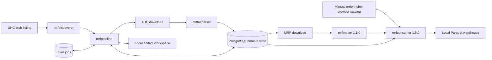
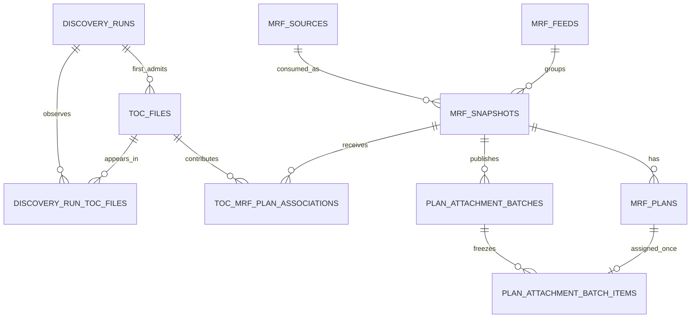
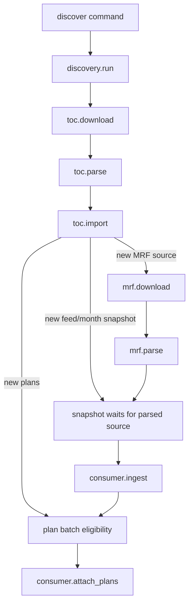

# mrfpipeline design

## Document status

This document describes the intended version 1 end state of `mrfpipeline`.
The numbered requirement stories are the implementation sequence and remain
authoritative where they are more specific. A later story may supersede an
earlier placeholder or refine a detail that this document deliberately assigns
to that story.

Stories 01 through 04 currently define the project foundation, PostgreSQL
domain schema, River runtime contract, and local artifact/download boundary.
Stories 05 through 13 are the planned delivery sequence for the production
pipeline. This is a design document, not a claim that those stages are already
implemented.

The design records the product decisions that must remain consistent across
stories:

- Discover TOCs incrementally; do not wait for an unknowable "complete" payer
  set before processing useful work.
- Download and parse one exact MRF URL once, even when several TOCs reference
  it.
- Keep `mrfparser` plan-independent.
- Ingest rates once per consumer snapshot, then attach newly discovered plans
  additively without rewriting rate/provider data.
- Use PostgreSQL domain records as durable pipeline truth and River for
  at-least-once background execution.
- Use numeric database identities and exact database uniqueness. Do not add
  hashes as URL, artifact, job, plan, or output identity.

## Purpose

CMS Transparency in Coverage data is published as a large graph rather than a
single file:

1. A payer-specific listing exposes table-of-contents files.
2. Each TOC associates plans with one or more in-network MRF locations.
3. The same in-network MRF can appear in several TOCs and can acquire more plan
   associations later.
4. In-network MRFs are large and expensive to download and parse.
5. Parsed rate data must be filtered through a manually maintained provider
   catalog and combined into one analytical warehouse.

The independent tools already own each transformation. `mrfpipeline` owns the
durable coordination between them:

- what was discovered;
- which exact source is new;
- what stage is eligible;
- which work is already complete;
- how a crash is retried;
- which payer/feed/month snapshot consumes a parsed source; and
- which plans have been attached to that snapshot.

The pipeline is not a replacement parser or warehouse engine. It passes stable
inputs into the existing tools, validates their publication boundaries, and
records durable orchestration state.

## Goals

Version 1 must:

- Run a manually triggered UHC TOC discovery.
- Support a small discovery limit for initial test runs, such as five to ten
  newly admitted TOCs.
- Store discoveries, TOCs, exact MRF URLs, feed/month snapshots, plan
  associations, and stage state in PostgreSQL.
- Execute download, parse, import, consumer-ingest, and plan-attachment work in
  River background jobs.
- Retry safely after a process, database, network, or tool failure.
- Reuse a completed MRF parse when another TOC references the same exact URL.
- Create one consumer snapshot for each required payer/feed/month association.
- Add newly discovered plans to an existing consumer output without
  re-ingesting rates.
- Keep large downloads and parser outputs in a deterministic local workspace.
- Preserve a single local `mrfconsumer` warehouse with serialized writers.
- Use a provider catalog produced manually by `mrfenricher`.
- Expose enough durable state for a later operational UI without building that
  UI now.

## Non-goals

Version 1 does not include:

- Automatic `mrfenricher` execution or taxonomy refresh scheduling.
- A web API, dashboard, or end-user plan-search UI.
- A payer other than UHC.
- Internal recurring discovery scheduling.
- Removal or replacement of an attached plan.
- Correction of a bad plan association inside an existing warehouse.
- MRF content deduplication across different URLs.
- URL normalization or filename-based identity.
- Content hashes, file hashes, hash-derived paths, or hash-derived job keys.
- S3 pipeline artifacts, distributed storage, or several worker hosts.
- Several concurrent worker processes writing one warehouse.
- Migration of old parser outputs or pre-1.5.0 consumer warehouses.
- Automatic source/artifact retention or deletion beyond stage-owned cleanup.

## System context



PostgreSQL and River are the control plane. The local artifact workspace,
parser outputs, provider catalog, and consumer warehouse are the data plane.

## Existing component contracts

The pipeline integrates with these independently usable tools. Their own
requirements remain authoritative for parsing and warehouse semantics.

| Component | Pipeline use | Version 1 boundary |
|---|---|---|
| `mrfdiscoverer` | Return current UHC TOC URLs in listing order. | UHC listing only; it does not download TOCs. |
| `mrftocparser` | Parse one local TOC into `toc_files` and flattened `mrf_plan_associations`. | Local input/output, exact schema `1.0.0`, final `manifest.json`. |
| `mrfparser` | Parse one local in-network MRF using the configured service selector. | Exact plan-independent schema `1.1.0`, eight datasets, final `manifest.json`. |
| `mrfenricher` | Produce an up-to-date provider catalog for selected taxonomies. | Operator runs it manually; pipeline receives a local catalog path. |
| `mrfconsumer` | Ingest one parser output into a snapshot and attach plans later. | Exact warehouse/snapshot version `1.5.0`; serialized local writers. |

The active pipeline pairing is exact: parser `1.1.0` with consumer `1.5.0`.
Parser `1.0.0` outputs and consumer `1.4.0` warehouses belong to the former
plan-aware layout and are not mixed with or migrated into this pipeline.

The pipeline must not copy the implementation of a sibling tool. It validates
the documented inputs, versions, reports, and final manifests needed to decide
whether a stage completed.

The exact integration form—direct Go package call or controlled child process—
is an internal boundary selected by the worker story for that component. It
must preserve context cancellation, exact version checks, output redaction,
single-invocation semantics, and the component's existing CLI/package
contract. `mrfparser` requires particular care because its package temporarily
changes the process-wide Go memory limit and does not support concurrent parser
invocations.

## Deployment model

Version 1 assumes one deployment unit with:

- PostgreSQL 15 or newer.
- One `mrfpipeline work` process for one application database and one
  warehouse.
- One local artifact filesystem visible to that worker.
- One local `mrfconsumer` warehouse.
- One local provider catalog prepared by the operator.
- One local service-selector CSV passed to `mrfparser`.
- Outbound public HTTP/HTTPS access to payer and CDN endpoints.

The database may be remote. The artifact workspace, provider catalog, service
selector, and warehouse must be accessible through local filesystem paths on
the worker host. Version 1 does not coordinate a shared filesystem between
hosts.

The one-process rule is important. River queue concurrency is per client, not
cluster-wide. Starting a second worker process would multiply download/parser
concurrency and could permit two writers to mutate the same consumer warehouse.

## Operator commands

The version 1 executable has three operational commands:

```text
mrfpipeline migrate
mrfpipeline work
mrfpipeline discover --payer uhc --collection-month <YYYY-MM> [--limit <count>]
```

`migrate` explicitly applies current application and River migrations. No
other command migrates automatically.

`work` validates the complete worker configuration and current schema, opens
the local workspace, starts the registered River workers, and runs until
canceled.

`discover` creates and enqueues one durable discovery run. It does not wait for
TOC downloads, MRF parsing, consumer ingestion, or plan attachment.

Discovery is manually invoked or scheduled externally. The caller supplies
the collection month; the pipeline does not infer it from current time, a URL,
or payer contents.

## Runtime configuration

The established environment is:

| Variable | Purpose |
|---|---|
| `MRFPIPELINE_DATABASE_URL` | PostgreSQL application and River database. |
| `MRFPIPELINE_ARTIFACT_ROOT` | Pipeline-owned local downloads and intermediate outputs. |
| `MRFPIPELINE_WAREHOUSE_PATH` | One local `mrfconsumer` warehouse root. |
| `MRFPIPELINE_PROVIDER_CATALOG_PATH` | Manually prepared provider catalog. |
| `MRFPIPELINE_SERVICES_PATH` | Service-selector CSV for `mrfparser`. |

`migrate` and `discover` need only the database URL. `work` needs the complete
set. Configuration has no file format and secrets are not accepted through
command-line flags.

Future worker stories may need to pin a sibling-tool invocation mechanism, but
they must not add incidental configuration merely to expose internal package
structure. Any new required deployment value must be introduced explicitly in
its story and reflected here.

## Durable identity model

### Numeric identities

PostgreSQL-generated positive `bigint` identity values own application
records. They produce stable operational identifiers such as:

```text
toc-42
mrf-source-81
mrf-105
plan-batch-230
```

These are formatted database identities. They are not source identity or
content identity.

### URL identity

TOC and MRF source identity is exact stored URL equality:

- TOCs are unique by `(payer_id, source_url)`.
- MRF sources are globally unique by `source_url`.

The pipeline does not trim, case-fold, percent-decode, reorder queries, remove
tokens, compare basenames, follow redirects to derive identity, or compare
downloaded bytes. Two different URL strings remain different records even if
they happen to return the same bytes.

### MRF source versus consumer snapshot

An MRF source and a consumer snapshot are deliberately separate:

```text
mrf_source = one exact URL + one download/parse lifecycle
mrf_snapshot = one parsed source + one payer feed + one collection month
```

One source can therefore be parsed once and consumed into several feed/month
snapshots when TOC associations require it. One snapshot has one stable
consumer `output_id`, formatted as `mrf-<mrf_snapshots.id>`.

This avoids re-parsing shared MRFs without pretending that an exact URL is a
stable logical feed identifier across months.

### Plan identity

Plans are unique within an MRF snapshot by the exact five-field tuple:

```text
plan_name
issuer_name
plan_id_type
plan_id
plan_market_type
```

Sponsor is validated and retained for TOC provenance where supplied, but is
not consumer plan identity. EIN requires a nonempty sponsor. HIOS stores a
null operational sponsor in the projected canonical row; an empty sponsor is
invalid.

Plan attachment batch IDs name additive publication attempts. They are not
plan identity and are not reused for a different set of newly batched plans.

## Domain model

Application tables live in PostgreSQL schema `mrfpipeline`. River manages its
own tables in `mrfpipeline_river`.

The central application records are:

| Table | Meaning |
|---|---|
| `discovery_runs` | One caller-requested payer listing discovery. |
| `toc_files` | One exact admitted payer TOC URL and its download/parse/import stages. |
| `discovery_run_toc_files` | Which admitted TOCs appeared in one run and in what listing order. |
| `mrf_feeds` | Caller/orchestrator-owned payer feed identities. |
| `mrf_sources` | One exact MRF URL and its shared download/parse lifecycle. |
| `mrf_snapshots` | One source consumed for one feed and collection month. |
| `toc_mrf_plan_associations` | Full accepted TOC provenance connecting a TOC, snapshot, MRF location, and plan. |
| `mrf_plans` | Sponsor-independent plan set still to be attached to each snapshot. |
| `plan_attachment_batches` | One additive consumer attachment attempt. |
| `plan_attachment_batch_items` | Frozen plans assigned to that batch. |



Domain records are retained even after River prunes completed jobs. Future UI
and operator status queries read domain state, not River history.

## Stage state model

Pipeline stages use:

```text
blocked -> pending -> running -> succeeded
                         |
                         +-> pending   (retryable error)
                         |
                         +-> failed    (attempts exhausted or operator action)
```

`blocked` means the immediate prerequisite has not completed. `pending` means
the stage is eligible and has or may receive a River job. `running` is a
durable claim by the assigned River job. `succeeded` and `failed` are terminal
for ordinary worker execution.

River executes at least once. A worker must tolerate:

- receiving the same job again;
- a crash after external work but before database success;
- a crash after artifact publication but before successor enqueueing;
- a stale job arriving after a replacement was assigned; and
- a domain row remaining `running` after the process disappeared.

Each job carries only one positive application database ID. It reloads every
mutable value from PostgreSQL.

## Transaction and job publication model

No transaction remains open during payer HTTP, a download, filesystem work,
Parquet processing, parser execution, or consumer execution.

A stage follows three short database phases:

1. **Claim:** lock the domain row, reject stale/ineligible work, and mark the
   assigned stage `running`.
2. **External work:** run with no database transaction held, using idempotent
   artifact and tool completion boundaries.
3. **Finalize:** lock and re-read the row, persist success, unblock the next
   stage, insert its River job with `InsertTx`, and store that job ID in the
   same transaction.

Initial scheduling follows the same atomic rule. For example, `discover`
creates a `discovery_runs` row and its `discovery.run` River job together.

The database row lock and unique constraints arbitrate scheduling. River
unique-job options are not used. A retained River row with similar arguments
is neither identity nor proof that the application stage was published.

## River job graph



The graph is event-driven rather than one monolithic chain. TOC import can
discover:

- a brand-new MRF source;
- an already downloaded but not parsed source;
- an already parsed source;
- a new snapshot for an existing source;
- new plans for an already consumed snapshot; or
- only associations that are already known.

Each case schedules only the work that is newly eligible.

## Queue topology

The one worker process uses these fixed initial bounds:

| Queue | Workers | Work |
|---|---:|---|
| `discovery` | 1 | Payer listing discovery. |
| `toc_download` | 4 | TOC HTTP downloads. |
| `toc_parse` | 2 | TOC parsing. |
| `toc_import` | 2 | TOC Parquet import and domain projection. |
| `mrf_download` | 2 | Large MRF downloads. |
| `mrf_parse` | 1 | Plan-independent MRF parsing. |
| `consumer` | 1 | Snapshot ingest and plan attachment. |

The consumer operations share one queue so all writes to the warehouse are
serialized. MRF parse concurrency is one because it is the heaviest resource
stage and its current parser contract does not support concurrent invocations
inside one process.

Every job has eight attempts using River's exponential retry policy with
jitter. Workers have no ordinary execution timeout because large MRF work may
take hours, but they honor cancellation. River may rescue a job considered
stuck after the configured threshold, so domain claims and artifact completion
rules—not an assumption of exactly-once execution—preserve correctness.

## End-to-end workflow

### 1. Create a discovery run

The operator runs, for example:

```text
mrfpipeline discover --payer uhc --collection-month 2026-08 --limit 5
```

The command validates current application and River schema, then atomically:

- inserts one pending `discovery_runs` row with payer, caller-selected month,
  and optional limit;
- inserts one `discovery.run` River job carrying only the run ID; and
- stores the River job ID on the run.

CLI success means the discovery was durably enqueued. It does not mean the
listing or any downstream stage completed.

### 2. Discover TOC URLs

The discovery worker calls the UHC adapter through `mrfdiscoverer`. UHC
currently returns one blob-listing JSON document. `mrfdiscoverer` selects blob
names ending in exact `_index.json` and returns each `downloadUrl` exactly in
listing order.

The worker records known and new URLs transactionally:

- Known exact `(payer_id, source_url)` rows are reused and observed again.
- New exact URLs are candidates for admission.
- `--limit` bounds newly admitted TOCs, not the number of known results in the
  payer listing.
- Newly admitted TOCs receive a `toc.download` job.
- The discovery run records discovered, existing, and admitted counts.

The detailed behavior for new candidates after the limit is reached—including
which membership rows are stored—is owned by Story 05 and must remain
consistent with the Story 02 schema.

### 3. Download a TOC

The TOC download worker reads the exact URL from its `toc_files` row and uses
the shared HTTP downloader. It publishes:

```text
toc/toc-<id>/download/
  data
  manifest.json
```

The source filename and extension are irrelevant. The download is complete
only when its small manifest is valid and its byte count equals `data` size.
After success, the worker marks download succeeded and atomically schedules
`toc.parse`.

### 4. Parse the TOC

The TOC parse worker inspects:

```text
toc/toc-<id>/parsed/
```

- A valid supported parser manifest means the parse already completed and can
  be finalized without re-running the parser.
- Nonempty output without a manifest is incomplete and is removed before a
  retry.
- Absent or empty output is eligible for one parser invocation.

It supplies:

- `download/data` as local input;
- `parsed` as local output;
- `toc-<toc_files.id>` as `toc_output_id`;
- the stored payer ID; and
- the first-admitted collection month.

Success requires exact `mrftocparser` schema/manifest version `1.0.0`, both
fixed datasets, and a valid final manifest. The worker can then delete the TOC
download bytes, mark parse succeeded, and schedule `toc.import`.

### 5. Import TOC associations

The import worker validates and reads only the completed TOC
`mrf_plan_associations` Parquet output. Each accepted row connects:

- the source TOC;
- the exact `mrf_location` URL;
- optional MRF filename;
- the caller-selected collection month and payer context;
- a logical feed assigned by the UHC feed policy; and
- one valid six-field source plan.

In one or more bounded database transactions, it:

1. Upserts the exact global `mrf_sources.source_url`.
2. Upserts the selected payer `mrf_feeds` row.
3. Upserts the unique source/feed/month `mrf_snapshots` row.
4. Inserts exact TOC provenance into `toc_mrf_plan_associations`.
5. Projects the sponsor-independent plan into `mrf_plans`.
6. Schedules newly eligible MRF downloads or consumer ingests without
   duplicating existing stage jobs, and leaves newly inserted plans as durable
   unassigned eligibility for Story 12 batching.

Feed identity is not inferred by Story 02. Story 08 assigns the conservative
version 1 UHC value `mrf-source-<mrf_sources.id>`. The same exact source URL
therefore keeps one feed across collection months, while a changed URL creates
a different feed. This policy uses no source string or hash and deliberately
does not claim cross-URL monthly continuity. A future curated mapping requires
an explicit warehouse/version strategy.

Import is idempotent. Re-reading the same completed TOC output inserts no
duplicate provenance, source, snapshot, or canonical plan.

After successful import, downstream scheduling and plan projection use the
PostgreSQL association and plan rows. The consumer never queries TOC Parquet
directly, and a later attachment does not require rerunning or reopening every
TOC that previously referenced the MRF. Retention of imported TOC parser output
is an operational decision for Story 13.

### 6. Download one shared MRF source

Only a newly eligible `mrf_sources` row receives `mrf.download`. Every TOC that
contains the exact same `mrf_location` reuses that row.

The shared downloader publishes:

```text
mrf/mrf-source-<id>/download/
  data
  manifest.json
```

After a valid completed download, the worker marks download succeeded and
schedules `mrf.parse` once. It does not include plans, feed, payer, month, or a
consumer output ID in the parser job.

### 7. Parse one shared MRF source

The MRF parse worker supplies:

- the source's `download/data`;
- the configured `MRFPIPELINE_SERVICES_PATH` selector; and
- `mrf/mrf-source-<id>/parsed` as output.

It does not supply plans. Parser 1.1.0 writes exactly eight plan-independent
datasets:

```text
mrf_files
services
service_relations
rate_groups
negotiated_prices
rate_provider_groups
provider_groups
providers
```

The six nullable root plan columns in `mrf_files` remain physical source audit
metadata. They are not canonical plan associations and do not influence
pipeline plan attachment.

As with TOCs, a valid exact `1.1.0` manifest makes a retry reusable. A partial
manifest-absent output is deleted before a full retry. After parse success the
download bytes may be deleted, but the parsed output is retained because later
TOCs can create another snapshot or add associations for this shared source.

When parse succeeds, every blocked snapshot for that source whose other
requirements are satisfied becomes eligible for `consumer.ingest`.

### 8. Ingest one consumer snapshot

One `mrf_snapshots` row supplies:

- the shared completed parser output;
- the configured provider catalog;
- the single configured warehouse;
- payer ID from its feed;
- exact logical `feed_id`;
- collection month; and
- `mrf-<mrf_snapshots.id>` as consumer `output_id`.

`mrfconsumer` 1.5.0 validates parser 1.1.0, filters providers using the pinned
catalog, and atomically publishes one immutable six-dataset rate snapshot.
Ingest is plan-independent and never reads TOC plans.

Consumer output IDs are immutable. A successful retry must recognize durable
domain success or the consumer's published output rather than attempt a second
ingest with the same ID.

A completed snapshot with no plan attachment is valid warehouse state, but it
is not ready for plan-filtered serving. After ingest success, the pipeline
batches all currently unassigned known plans for that snapshot and schedules
`consumer.attach_plans`.

### 9. Attach plans additively

For one attachment batch, the pipeline projects frozen `mrf_plans` rows to an
exact local `plans.json` array containing only:

```text
plan_name
issuer_name
plan_sponsor_name
plan_id_type
plan_id
plan_market_type
```

TOC-specific location, filename, output ID, provenance, and extension fields
are not included. The consumer receives:

- that JSON path;
- the warehouse path;
- `mrf-<snapshot-id>` as `output_id`; and
- `plan-batch-<batch-id>` as `plan_batch_id`.

`mrfconsumer.AttachPlans` compares the five-field identities with existing
warehouse plan associations and writes only missing rows. It never reads or
rewrites the snapshot's rate/provider Parquet.

The required behavior is:

```text
attach A, B -> publish A, B
attach B, C -> publish only C; warehouse now exposes A, B, C
attach B, C -> successful no-op with added_plan_count = 0
```

The pipeline stores the consumer-reported added count and marks the batch
succeeded even when the count is zero.

The consumer publishes a new immutable plan-association Parquet part; it does
not replace an existing plans file. Its `all_output_plans` DuckDB view reads the
warehouse-level part glob, and later queries—including queries on an already
open supported DuckDB connection—must see a newly published part without an
orchestrator-issued refresh or warehouse restart. That behavior is part of the
consumer 1.5.0 acceptance contract.

### 10. Handle plans discovered later

The pipeline never waits for every payer TOC before parsing an MRF. There may
be thousands of current TOCs, future discoveries may add more, and there is no
durable signal that the payer's plan association set is permanently complete.

Instead, association is incremental:

1. The first TOC referencing an exact MRF can start its one download and parse.
2. Its snapshot can be ingested as soon as the source parse and snapshot
   prerequisites are complete.
3. Currently known plans are attached in one batch.
4. A later TOC referencing the same source inserts only previously unknown
   snapshot plans.
5. If the snapshot already exists and is consumed, those new plans receive a
   new attachment batch.
6. No MRF download, MRF parse, or rate ingest is repeated merely because the
   plan set grew.

If a plan arrives while another attachment batch is pending or running, it is
left unassigned for the next batch. Completion/reconciliation schedules that
next batch. The database constraint that a plan belongs to at most one batch
prevents overlapping publication attempts.

This model directly handles the common case where several TOCs reference one
network file. It also avoids a payer-wide barrier that would delay all useful
work and still fail to define what "all TOCs" means across later discoveries.

## Plan lifecycle and limitations

Plan association is append-only:

- Plans may be added.
- Existing plan identities are idempotent no-ops.
- Plans are never removed, replaced, revised, or expired inside a consumer
  output.
- Sponsor variants do not create another consumer plan identity.
- A batch ID names one publication attempt and cannot be reused for new plans.

This simplicity has a deliberate limitation: an incorrect plan association is
permanent for that warehouse output. Correcting it requires rebuilding the
warehouse or an explicit future query exclusion mechanism. Creating another
snapshot casually is not a safe correction because same-feed, same-month ties
can duplicate current rates.

The pipeline should expose an output as plan-ready only when:

- consumer ingest succeeded;
- at least its initial valid plan batch succeeded; and
- no currently known plan is unassigned or held by a pending/running/failed
  unresolved batch.

That readiness can be derived from the domain tables in version 1. A later UI
may materialize it, but it must not redefine attachment identity.

## Local artifact model

The pipeline owns this versioned workspace:

```text
<artifact-root>/
  workspace.json
  .staging/
  toc/toc-<toc-id>/
    download/data
    download/manifest.json
    parsed/...
    parsed/manifest.json
  mrf/mrf-source-<source-id>/
    download/data
    download/manifest.json
    parsed/...
    parsed/manifest.json
  plan-batches/plan-batch-<batch-id>/
    plans.json
```

Download directories appear atomically only after the body and byte-count
manifest are closed. The byte count detects incomplete local publication; it
is not a checksum and does not claim remote content identity.

Sibling parser output manifests remain authoritative:

- manifest absent: incomplete output, safe to delete at its exact generated
  leaf before retry;
- supported valid manifest present: completed immutable output, preserve and
  reuse;
- manifest present but invalid/unsupported: artifact/tool contract failure,
  never silently delete as ordinary partial work.

The artifact root must not equal, contain, or be contained by the warehouse,
provider catalog, or services path. Generic cleanup accepts generated kind/ID
addresses, never arbitrary caller paths or globs.

## Download model

TOC and MRF stages share one streaming HTTP client:

- HTTP/HTTPS only.
- Public network destinations only; local, link-local, and private addresses
  are rejected after resolution.
- At most five safe redirects and no HTTPS downgrade.
- Status 200 only.
- No transparent HTTP decompression.
- Fixed memory buffer and no whole-body buffering.
- No whole-request timeout; River context owns cancellation.
- No internal retry loop or range resume.
- No URL logging, response-body logging, content hashing, or URL-derived
  filename.

A complete existing download is reused without another request. An incomplete
download is removed only from its exact generated leaf and restarted.

## Provider enrichment boundary

Provider enrichment is intentionally outside automatic orchestration in
version 1.

The operator:

1. Chooses the supported taxonomy set.
2. Runs `mrfenricher` manually.
3. Places or points to the resulting provider catalog.
4. Starts the worker with `MRFPIPELINE_PROVIDER_CATALOG_PATH`.

`mrfconsumer` copies and pins the first accepted catalog into a new warehouse.
Changing the supported taxonomies, NPPES release, or catalog contents requires
the consumer's documented new-warehouse procedure. The pipeline does not
mutate or refresh the pinned catalog while jobs are active.

## Failure, retry, and recovery

### Retryable stage failure

A worker returns its assigned stage from `running` to `pending`, keeps any
completed reusable artifact, and returns a safe error to River. River applies
the shared retry policy.

### Exhausted stage

On the final attempt, the assigned stage becomes `failed` with a fixed safe
failure code. Raw database, network, path, source, parser, consumer, plan, or
response data is never stored in `failure_code`.

### Crash windows

The design intentionally tolerates these boundaries:

| Crash point | Recovery |
|---|---|
| Before domain/job transaction commit | Neither scheduling mutation is visible; retry transaction. |
| After job claim, before external publication | River retry reclaims the same stage. |
| During download | Only a targeted staging entry exists; clean and restart. |
| After download rename, before database success | Validate and reuse completed download. |
| During parser output | Manifest absent; delete exact partial output and rerun. |
| After parser manifest, before database success | Validate and reuse completed parser output. |
| During consumer ingest | Let consumer's immutable output/recovery contract decide; do not manually merge files. |
| After snapshot publication, before database success | Validate exact output ID and reconcile domain success without re-ingesting. |
| During plan attachment | Reuse the same batch ID for retry of that batch; consumer makes an already published batch/idempotent plan set a no-op. |
| After stage success, before successor insertion | Normally impossible because both commit together; Story 13 repairs historical or unexpected gaps. |

Story 13 owns explicit reconciliation and operator procedures for durable
states that cannot be repaired by ordinary retry, including stale `running`
claims, discarded jobs whose domain update failed, missing successors,
consumer seed recovery, and unsupported multi-worker deployment.

Recovery never guesses from a filename or creates a new plan-batch ID for the
same frozen batch merely because acknowledgement was lost.

## Security and privacy

The pipeline stores exact URLs and plan values in PostgreSQL because they are
required domain data. It does not expose them through routine logs or CLI
diagnostics.

Sensitive or high-cardinality values excluded from production diagnostics
include:

- Database URLs and server coordinates.
- TOC/MRF source and redirect URLs, including query tokens.
- Local configured or derived paths.
- HTTP headers and response bodies.
- Plan, provider, service, and negotiated-rate values.
- SQL text and database diagnostic detail.
- Raw sibling-tool standard output/error.

Jobs carry numeric database IDs only. Ordinary structured logs may include a
fixed event, job kind/queue, River job ID, attempt, safe failure class,
duration, and unlabeled counts as permitted by Story 03.

The downloader blocks private/local network destinations and unsafe redirects.
The artifact workspace rejects symlinks and overlap with external data roots.
Database credentials, TLS policy, filesystem ownership, disk encryption, and
PostgreSQL roles remain deployment responsibilities.

## Observability

Durable operator state comes from application tables:

- discovery run status and counts;
- TOC download/parse/import status;
- shared MRF download/parse status;
- snapshot consumer status;
- attachment batch status and requested/added counts;
- safe terminal failure classifications; and
- created, started, completed, first-seen, last-seen, and updated timestamps.

River provides execution attempts and queue mechanics but is not long-term
business history. Artifact manifests prove publication at tool boundaries.

Version 1 uses structured standard-error logs and machine-readable CLI success
reports. Prometheus, OpenTelemetry, alerting rules, and an HTTP status endpoint
are deferred. The future UI should query a read model derived from these domain
records rather than scrape worker logs.

## Data and resource bounds

The pipeline applies concurrency rather than arbitrary MRF-size limits:

- Discovery: one payer request at a time.
- TOC downloads: four.
- TOC parsers/importers: two each.
- MRF downloads: two.
- MRF parser: one.
- Consumer writer: one.

HTTP bodies stream through a fixed buffer. Parsers retain their existing
bounded-memory and temporary-workspace contracts. TOC association import must
read Parquet in bounded batches and use database upserts rather than load all
payer history into memory.

The initial `--limit 5` or `--limit 10` discovery run bounds newly admitted
TOCs, not MRF count: one TOC may reference several MRFs. Operators must monitor
disk and database growth during test runs. Story 13 defines operational sizing
and cleanup guidance after representative data exists.

## Ordering and consistency

- `mrfdiscoverer` listing order is preserved for discovery ordinals.
- URL uniqueness is exact database equality, independent of listing order.
- TOC imports may finish out of order.
- MRF sources and snapshots may become eligible out of order.
- Consumer writes are serialized, but their order is not plan identity.
- Plans are sorted deterministically when generating a batch document.
- Later plan arrival is additive and does not invalidate an earlier completed
  parse or ingest.

There is no global payer barrier. The system provides per-record convergence:
when all currently known prerequisites for a record are complete, that record
advances.

## Story sequence

The proposed implementation sequence is:

| Story | Deliverable |
|---:|---|
| 01 | Project foundation and CLI/configuration contract. |
| 02 | PostgreSQL domain schema and application migrations. |
| 03 | River schema/runtime, job catalog, queue, retry, and transaction contract. |
| 04 | Local artifact workspace, completion inspection, cleanup, and HTTP downloader. |
| 05 | UHC discovery worker, `discover` enqueue behavior, and bounded test runs. |
| 06 | TOC download worker. |
| 07 | TOC parse worker and exact `mrftocparser` validation. |
| 08 | TOC association import, UHC feed assignment, MRF/snapshot/plan upserts, and eligibility scheduling. |
| 09 | Shared MRF download worker. |
| 10 | Plan-independent MRF parse worker and exact parser 1.1.0 validation. |
| 11 | Consumer snapshot ingest worker and warehouse/provider-catalog recovery. |
| 12 | Plan batch projection and additive consumer attachment worker. |
| 13 | Reconciliation, operational acceptance, bounded real-data run, retention guidance, and final documentation. |

Each worker story must include its own retry/crash tests and prove it conforms
to Stories 03 and 04. Story 13 validates the complete pipeline with a small UHC
discovery first, then several representative MRFs before UI work begins.

## Cross-story acceptance

The version 1 pipeline is complete when all of the following are proven:

1. A migration initializes current application and River schemas and is safe
   to rerun.
2. A bounded UHC discovery durably admits only the requested number of new
   TOCs while recording known results correctly.
3. Every admitted TOC downloads, parses, and imports through idempotent River
   jobs.
4. Two or more TOCs referencing the same exact MRF URL create one source,
   download, and parse lifecycle.
5. MRF parsing succeeds without TOC plans and produces exact parser 1.1.0
   output.
6. Every required feed/month snapshot is ingested once with a stable numeric
   output ID.
7. Plans A/B followed later by B/C result in warehouse associations A/B/C,
   while the second attachment writes only C and an identical retry writes
   nothing.
8. Adding plans does not read or rewrite rate/provider Parquet.
9. Process termination at each publication boundary converges through retry or
   documented reconciliation without duplicate domain rows or unsafe deletion.
10. The provider catalog remains manual and pinned; the pipeline never runs
    enrichment automatically.
11. Errors and logs do not expose URLs, paths, plan values, credentials, raw
    tool output, or response bodies.
12. No workflow identity or deduplication rule depends on a content hash.

## Deferred decisions owned by later stories

The following are intentional story-level decisions, not reasons to block this
design document:

- Story 10 pins the MRF parser invocation boundary, including exact
  version/preflight behavior.
- Stories 11 and 12 pin the consumer integration boundary and recovery mapping
  from consumer reports to domain state.
- Story 13 pins operator reconciliation commands or procedures, stale-job
  handling, real-data sizing, and artifact retention.

Those decisions must preserve the identities, state graph, plan independence,
additive attachment model, redaction, and single-warehouse serialization
defined here.
